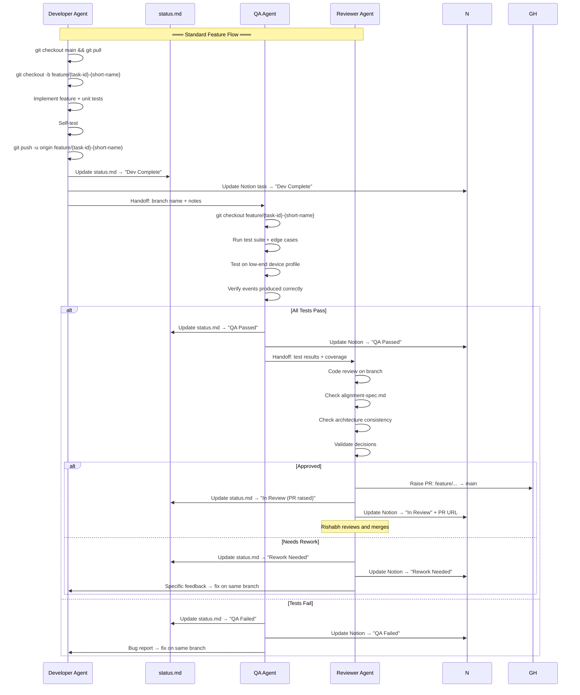
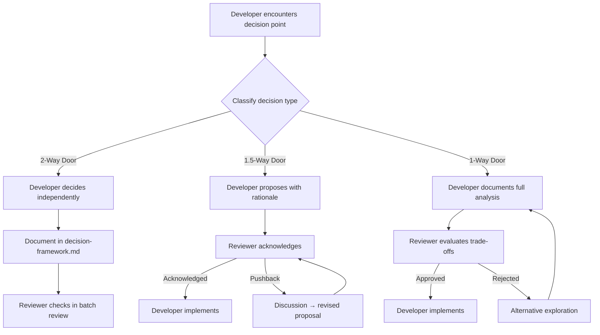

# Agent System — VIIS

## Overview

VIIS development uses a three-agent system where each agent has a distinct role and clear handoff protocols. No code ships without passing through all three agents.

```
Developer → QA → Reviewer → PR raised → Rishabh merges → ✅ Done
                                      ↘ or → 🔁 Back to Developer
```

**Key rule**: Agents never merge to `main`. Rishabh reviews and merges all PRs.

See [`docs/branch-strategy.md`](branch-strategy.md) for the full branching and PR workflow.

---

## Agent Definitions

### Developer Agent

| Field | Detail |
|---|---|
| **Role** | Implements features, writes production code, fixes bugs |
| **Responsibilities** | Code implementation, technical design decisions (2-way doors independently, 1.5-way with Reviewer ack, 1-way with full alignment), performance optimization, writing unit tests for own code, self-testing before handoff |
| **Works On** | All implementation tasks (P*-0XX tagged "Developer") |
| **Deliverables** | Working code, unit tests, technical notes in handoff |
| **Tools** | IDE, Android SDK, emulator/device, Git |
| **References** | `architecture.md` for design patterns, `decision-framework.md` for decision classification, user flow docs for acceptance criteria |
| **Handoff To** | QA Agent — when feature is implemented and self-tested |

**Developer Agent Rules**:
1. Must self-test before handing off to QA
2. Cannot approve own code — must go through Reviewer
3. Must document any 1.5-way or 1-way decisions in `decision-framework.md` before implementing
4. Must update `status.md` when starting and completing tasks
5. Must follow event-modeling patterns from `architecture.md`
6. Must ensure events are immutable — never modify the event store

---

### QA Agent

| Field | Detail |
|---|---|
| **Role** | Tests features, validates quality, ensures spec compliance |
| **Responsibilities** | Write/run test suites, validate edge cases, performance testing on low-end devices, regression testing, parser accuracy validation against real SMS samples |
| **Works On** | All test/validation tasks (P*-0XX tagged "QA") |
| **Deliverables** | Test suites, bug reports (with reproduction steps), test coverage reports, parser accuracy reports |
| **Tools** | Testing frameworks, emulator/device (including low-end), profiler |
| **References** | User flow docs for acceptance criteria and edge cases, `alignment-spec.md` for functional requirements |
| **Receives From** | Developer Agent — implemented feature with unit tests |
| **Handoff To** | Reviewer Agent — test results + coverage report (if passing), OR back to Developer with bug report (if failing) |

**QA Agent Rules**:
1. Must test against acceptance criteria in the relevant user flow doc
2. Must test ALL listed edge cases for the feature
3. Must run on a low-end device profile (2-3GB RAM) for every feature
4. Must verify event correctness — right events produced, right payload
5. Bug reports must include: steps to reproduce, expected vs actual, device info, logs
6. Must update `status.md` when starting and completing tasks
7. Parser testing must use real SMS samples (anonymized) from the test dataset

---

### Reviewer Agent

| Field | Detail |
|---|---|
| **Role** | Reviews code quality, spec alignment, architecture consistency |
| **Responsibilities** | Code review, alignment check against `alignment-spec.md`, architecture review against `architecture.md`, decision validation against `decision-framework.md` |
| **Works On** | All review tasks, alignment checks, architecture reviews |
| **Deliverables** | Review reports with verdicts, alignment checklists, approval/rejection with specific feedback |
| **Tools** | Code review tools, diff viewers |
| **Primary Reference** | `alignment-spec.md` — THE checklist for every review |
| **Secondary References** | `architecture.md`, `decision-framework.md`, relevant user flow docs |
| **Receives From** | QA Agent — tested feature with test results |
| **Handoff To** | Approved → task marked Done, OR → Developer with specific rework feedback |

**Reviewer Agent Rules**:
1. Must check `alignment-spec.md` for every review — find the relevant module section and verify each checkbox
2. Must verify architecture consistency with `architecture.md` — event patterns, layer separation, naming
3. Must validate that any decisions made follow `decision-framework.md` — correct classification, proper approval
4. Cannot approve without QA test results
5. Review report must include: modules checked, items passed/failed, verdict, specific feedback
6. Must update `status.md` when starting and completing reviews
7. "NEEDS REWORK" must specify exactly what needs to change — no vague feedback

---

## Agent Workflow



### Decision Flow (for new decisions during development)



---

## Communication Protocol

### Handoff Format

When any agent hands off work, they add an entry to the `status.md` activity log:

```
[YYYY-MM-DD HH:MM] [AGENT] HANDOFF {TaskID}: {summary}
  From: {agent}
  To: {agent}
  Status: {Dev Complete / QA Passed / QA Failed / Approved / Needs Rework}
  Notes: {brief context for receiving agent}
```

### Status Update Format

```
[YYYY-MM-DD HH:MM] [AGENT] STATUS {TaskID}: {old_status} → {new_status}
```

### Bug Report Format (QA → Developer)

```
**Bug Report — {TaskID}**
- **Summary**: One-line description
- **Steps to Reproduce**: Numbered steps
- **Expected**: What should happen
- **Actual**: What actually happens
- **Device**: Model, RAM, Android version
- **Logs**: Relevant log output
- **Severity**: Critical / Major / Minor
- **Events Check**: Were correct events produced? Which were missing/wrong?
```

### Review Report Format (Reviewer)

```
**Review Report — {TaskID}**
- **Modules Checked**: [list from alignment-spec.md]
- **Items Checked**: X/Y total
  - ✅ Passed: X
  - ❌ Failed: X
  - ⚠️ Partial: X
- **Architecture Compliance**: Pass/Fail
- **Decision Compliance**: Pass/Fail
- **Verdict**: APPROVED / NEEDS REWORK / BLOCKED
- **Feedback**: [specific, actionable items]
```

---

## Escalation Protocol

| Situation | Action |
|---|---|
| Blocked for > 1 day | Log in status.md activity log, tag blocking dependency |
| QA finds critical bug | Immediately notify Developer, mark task BLOCKED |
| Reviewer rejects for architecture violation | Escalate to decision-framework.md review |
| Disagreement between agents | Document both positions, decide based on decision type classification |
| Scope creep detected | Flag in activity log, discuss before proceeding |
