# VIIS Architecture — Event-Modeled System Design

## Table of Contents
1. [High-Level Design (HLD)](#1-high-level-design)
2. [Event Model](#2-event-model)
3. [Low-Level Design (LLD)](#3-low-level-design)
4. [Swimlane Diagrams](#4-swimlane-diagrams)
5. [Tech Stack](#5-tech-stack)
6. [Data Flow Diagram](#6-data-flow-diagram)

---

## 1. High-Level Design

### 1.1 System Overview

VIIS is an **offline-first, event-driven Android application** that passively tracks digital income for small Indian vendors by reading financial SMS messages. The system is modeled around **events as the source of truth** — every state change is captured as an immutable event, and all views/insights are projections derived from that event stream.

### 1.2 Core Principles (Event Modeling)

- **Events are facts** — "SMSReceived", "TransactionDetected", "DaySummarized" are immutable records of what happened
- **Commands are intents** — "ParseSMS", "ComputeInsights", "SendNotification" are requests that may produce events
- **Read Models are projections** — Dashboard, hourly breakdown, customer insights are all derived from the event store
- **Automations react to events** — TransactionDetected triggers aggregation; DayEnded triggers EOD notification

### 1.3 Component Overview

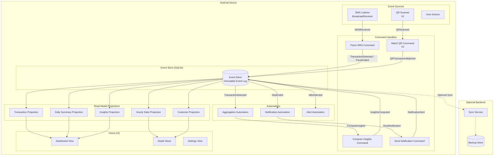

### 1.4 V1 vs V2 Components

| Component | V1 (SMS) | V2 (QR Addition) |
|---|---|---|
| SMS Listener | Yes | Yes |
| Parsing Engine | Yes | Yes |
| Event Store | Yes | Yes (extended) |
| Aggregation Automation | Yes | Yes (enhanced) |
| Insights Projection | Yes | Yes (enhanced) |
| Notification Automation | Yes | Yes |
| QR Generator | No | Yes |
| QR Metadata Tagger | No | Yes |
| Enhanced Matching Engine | No | Yes |

---

## 2. Event Model

### 2.1 Event Catalog

The entire system is described by these events flowing through time:

#### Source Events (External Triggers)
| Event | Source | Payload | Description |
|---|---|---|---|
| `SMSReceived` | Android OS | rawBody, sender, timestamp | Financial SMS detected by listener |
| `QRScanned` | Customer (V2) | qrId, metadata | Customer scanned vendor's QR code |
| `AppOpened` | User | timestamp | Vendor opened the app |
| `DayStarted` | Clock | date | New calendar day begins |
| `DayEnded` | Clock | date | Calendar day ends (9 PM trigger) |
| `MidDayReached` | Clock | date, time | Mid-day checkpoint (2 PM trigger) |

#### Domain Events (System-Produced)
| Event | Producer | Payload | Description |
|---|---|---|---|
| `TransactionDetected` | ParseSMS | amount, sender, timestamp, source, refId, status | Valid transaction parsed from SMS |
| `TransactionFailed` | ParseSMS | amount, sender, timestamp, reason | Failed/declined transaction identified |
| `DuplicateDetected` | ParseSMS | originalTxnId, duplicateSmsBody | Duplicate SMS caught by dedup |
| `ParseFailed` | ParseSMS | rawBody, reason | SMS could not be parsed |
| `CustomerIdentified` | CustomerProjection | customerId, name, upiHandle, isNew | Customer resolved from transaction |
| `DailySummaryComputed` | ComputeInsights | date, totalIncome, txnCount, avgValue, ... | Daily aggregation complete |
| `HourlyStatsUpdated` | ComputeInsights | hourBlock, txnCount, amount | Hourly bucket updated |
| `InsightGenerated` | ComputeInsights | insightType, value, comparison | Specific insight computed |
| `IdleDetected` | AlertAutomation | gapDuration, lastTxnTime | Unusual inactivity gap |
| `UnderperformanceDetected` | AlertAutomation | expected, actual, deficit | Below expected earnings |
| `NotificationSent` | SendNotification | type, title, body | Push notification delivered |
| `QRGenerated` | GenerateQR (V2) | qrId, upiId, metadata | Vendor's QR code created |
| `QRTransactionMatched` | MatchQR (V2) | txnId, qrId, confidence | SMS matched with QR payment |
| `DataSynced` | SyncService | recordCount, lastSyncTime | Data synced to backend |

### 2.2 Command Catalog

| Command | Triggered By | Produces Events | Description |
|---|---|---|---|
| `ParseSMS` | SMSReceived | TransactionDetected / TransactionFailed / DuplicateDetected / ParseFailed | Parse raw SMS into transaction |
| `ComputeInsights` | TransactionDetected | DailySummaryComputed, HourlyStatsUpdated, InsightGenerated | Recompute all projections |
| `SendEODNotification` | DayEnded | NotificationSent | End-of-day summary notification |
| `SendMidDayAlert` | MidDayReached + UnderperformanceDetected | NotificationSent | Mid-day underperformance alert |
| `SendInactivityAlert` | IdleDetected | NotificationSent | No transactions for unusual duration |
| `GenerateQR` | User (V2) | QRGenerated | Create vendor's UPI QR |
| `MatchQRTransaction` | TransactionDetected + QRGenerated (V2) | QRTransactionMatched | Correlate SMS with QR metadata |
| `SyncData` | Connectivity available | DataSynced | Upload local data to backend |

### 2.3 Read Model (Projection) Catalog

| Read Model | Built From Events | Serves View | Description |
|---|---|---|---|
| `TransactionList` | TransactionDetected, TransactionFailed | Transaction history | All transactions chronologically |
| `DailySummary` | DailySummaryComputed | Dashboard main card | Today's income, comparison, score |
| `HourlyBreakdown` | HourlyStatsUpdated | Hourly view | Hour-by-hour income distribution |
| `CustomerProfiles` | CustomerIdentified | Customer insights | Repeat/new customers, top payers |
| `WeeklyTrend` | DailySummaryComputed (7 days) | Weekly view | Rolling 7-day comparison |
| `ExpectedEarnings` | DailySummaryComputed (14 days) | Dashboard widget | Historical baseline vs actual |
| `RunRateProjection` | HourlyStatsUpdated + historical | Dashboard widget | Projected end-of-day income |
| `ConsistencyScore` | Multiple insights | Dashboard widget | Composite daily score |
| `PaymentMethodSplit` | TransactionDetected (source field) | Payment breakdown | UPI vs bank split |

### 2.4 Automation Catalog

| Automation | Listens To | Fires Command | Condition |
|---|---|---|---|
| AggregationAutomation | TransactionDetected | ComputeInsights | Always (real-time update) |
| EODAutomation | DayEnded | SendEODNotification | At least 1 transaction today |
| MidDayAutomation | MidDayReached | SendMidDayAlert | Actual < 70% of expected |
| IdleAutomation | TransactionDetected (gap check) | SendInactivityAlert | Gap > dynamic threshold |
| QRMatchAutomation (V2) | TransactionDetected | MatchQRTransaction | Active QR exists |
| SyncAutomation | ConnectivityRestored | SyncData | Pending unsynced events |

### 2.5 Event Model Timeline (Mermaid)

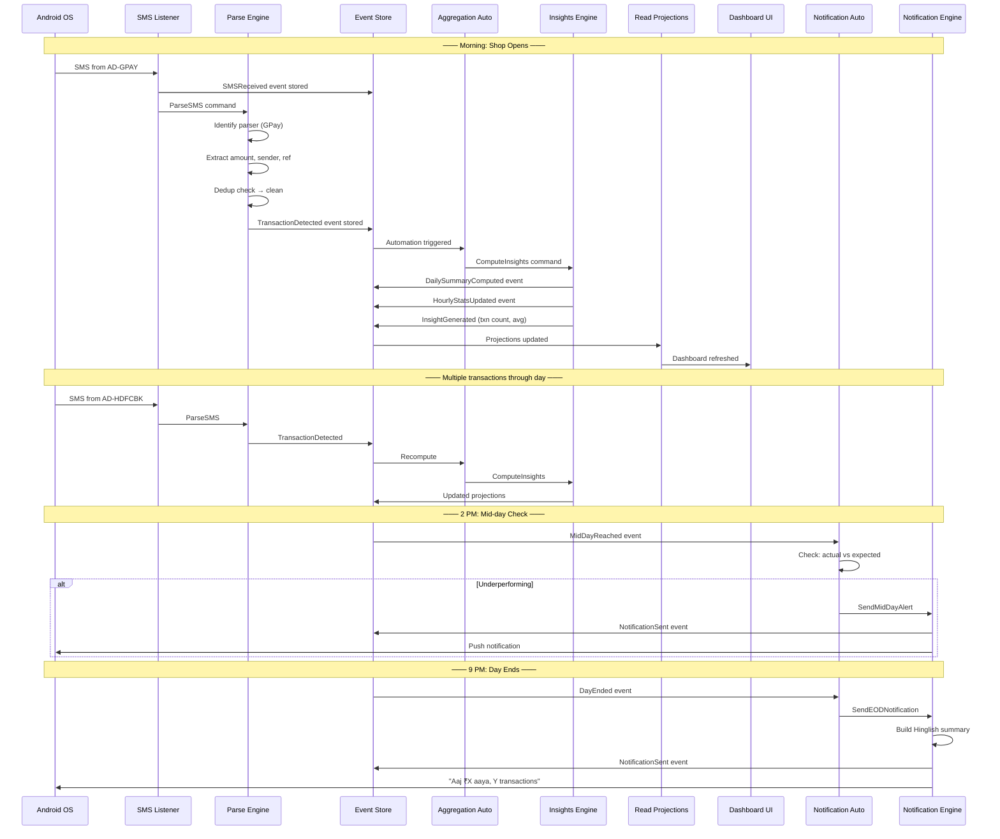

---

## 3. Low-Level Design

### 3.1 SMS Listener

**Implementation**: Android `BroadcastReceiver` for `SMS_RECEIVED` + `ContentObserver` on SMS content provider as fallback.

**Financial SMS Sender IDs** (filter list):
```
AD-SBIINB, AD-SBIPSG, AD-HDFCBK, AD-ICICIB, AD-AXISBK,
AD-KOTAKB, AD-PNBSMS, AD-BOIIND, AD-CANBNK, AD-UCOBNK,
AD-GPAY, AD-PHONEPE, AD-PAYTM, AD-AMAZONP, VD-GPAY,
VM-GPAY, JD-GPAY, BZ-GPAY
```

**Event Produced**: `SMSReceived { rawBody, senderId, timestamp, deviceId }`

**Key Behaviors**:
- Registers on app start / boot complete
- Filters by sender ID prefix (AD-, VD-, VM-, JD-, BZ-)
- Stores raw SMS in event store before any processing
- Works completely offline (SMS doesn't need internet)
- Battery-efficient (BroadcastReceiver, not polling)

### 3.2 Parsing Engine

**Architecture**: Parser Registry pattern with chain-of-responsibility fallback.

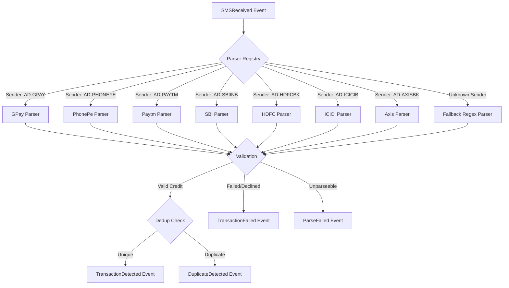

**Parser Interface**:
```kotlin
interface SmsParser {
    fun canParse(senderId: String): Boolean
    fun parse(rawBody: String, timestamp: Long): ParseResult
}

sealed class ParseResult {
    data class CreditTransaction(
        val amount: Double,
        val senderName: String?,
        val upiHandle: String?,
        val source: PaymentSource, // UPI, NEFT, IMPS, etc.
        val referenceId: String?,
        val status: TxnStatus
    ) : ParseResult()

    data class FailedTransaction(
        val amount: Double?,
        val reason: String
    ) : ParseResult()

    data class Unparseable(val reason: String) : ParseResult()
}
```

**Deduplication Logic**:
- Window: 5 minutes (configurable)
- Match: same amount + same sender + within window
- If reference_id available: exact match on reference_id
- Produces `DuplicateDetected` event (never silently drops)

**Fallback Chain**: Exact sender match → Regex patterns for common formats → Heuristic (look for ₹/Rs./INR + credited/received keywords) → ParseFailed event

### 3.3 Event Store (SQLite/Room)

**Core Philosophy**: Events are immutable. Read models are derived. The event store is the source of truth.

```sql
-- Immutable event log
CREATE TABLE events (
    event_id TEXT PRIMARY KEY,
    event_type TEXT NOT NULL,          -- 'TransactionDetected', 'SMSReceived', etc.
    timestamp INTEGER NOT NULL,
    payload TEXT NOT NULL,             -- JSON serialized event data
    version INTEGER NOT NULL DEFAULT 1,
    created_at INTEGER NOT NULL
);
CREATE INDEX idx_events_type ON events(event_type);
CREATE INDEX idx_events_timestamp ON events(timestamp);

-- Transaction projection (read model, rebuilt from events)
CREATE TABLE transactions (
    id TEXT PRIMARY KEY,
    event_id TEXT NOT NULL REFERENCES events(event_id),
    amount REAL NOT NULL,
    timestamp INTEGER NOT NULL,
    sender_name TEXT,
    upi_handle TEXT,
    source TEXT NOT NULL,              -- 'UPI', 'NEFT', 'IMPS', 'BANK'
    reference_id TEXT,
    status TEXT NOT NULL,              -- 'SUCCESS', 'FAILED', 'PENDING'
    is_duplicate INTEGER DEFAULT 0,
    created_at INTEGER NOT NULL
);
CREATE INDEX idx_txn_timestamp ON transactions(timestamp);
CREATE INDEX idx_txn_status ON transactions(status);
CREATE INDEX idx_txn_date ON transactions(timestamp / 86400000);

-- Customer projection (read model)
CREATE TABLE customer_profiles (
    customer_id TEXT PRIMARY KEY,      -- hash(upi_handle || normalized_name)
    display_name TEXT,
    upi_handle TEXT,
    first_seen INTEGER NOT NULL,
    last_seen INTEGER NOT NULL,
    transaction_count INTEGER DEFAULT 0,
    total_amount REAL DEFAULT 0,
    is_regular INTEGER DEFAULT 0       -- frequency > threshold
);
CREATE INDEX idx_cust_frequency ON customer_profiles(transaction_count DESC);

-- Daily summary projection (read model)
CREATE TABLE daily_summaries (
    date TEXT PRIMARY KEY,             -- 'YYYY-MM-DD'
    total_income REAL DEFAULT 0,
    transaction_count INTEGER DEFAULT 0,
    avg_transaction_value REAL DEFAULT 0,
    peak_hour INTEGER,                 -- 0-23
    first_txn_time INTEGER,
    last_txn_time INTEGER,
    expected_income REAL,
    run_rate_projection REAL,
    consistency_score REAL,
    new_customers INTEGER DEFAULT 0,
    returning_customers INTEGER DEFAULT 0,
    upi_amount REAL DEFAULT 0,
    bank_amount REAL DEFAULT 0
);

-- Hourly stats projection (read model)
CREATE TABLE hourly_stats (
    date TEXT NOT NULL,
    hour_block INTEGER NOT NULL,       -- 0-23
    txn_count INTEGER DEFAULT 0,
    total_amount REAL DEFAULT 0,
    PRIMARY KEY (date, hour_block)
);

-- QR codes (V2)
CREATE TABLE qr_codes (
    qr_id TEXT PRIMARY KEY,
    upi_id TEXT NOT NULL,
    metadata_tag TEXT NOT NULL,
    created_at INTEGER NOT NULL,
    is_active INTEGER DEFAULT 1
);

-- QR transaction matches (V2, read model)
CREATE TABLE qr_matches (
    match_id TEXT PRIMARY KEY,
    transaction_id TEXT REFERENCES transactions(id),
    qr_id TEXT REFERENCES qr_codes(qr_id),
    confidence REAL NOT NULL,          -- 0.0 - 1.0
    matched_at INTEGER NOT NULL
);
```

### 3.4 Aggregation Automation

**Trigger**: Every `TransactionDetected` event.

**Behavior**: Recomputes affected read models incrementally (not full rebuild).

**Expected Earnings Baseline**:
```
expected_by_now = avg(same_weekday_income_at_this_hour, last 14 days)
```
Uses rolling 14-day window of same weekday. If < 7 data points, uses all available days.

**Run Rate Projection**:
```
projected_eod = (current_total / hours_elapsed) * typical_active_hours
```
Weighted: 60% current pace, 40% historical same-weekday curve shape.

**Consistency Score** (0-100):
```
score = w1 * alignment_score + w2 * stability_score + w3 * activity_score
where:
  alignment_score = 100 - abs(actual - expected) / expected * 100  (capped at 0)
  stability_score = 100 - coefficient_of_variation(hourly_amounts) * 100
  activity_score  = (active_hours / typical_active_hours) * 100
  w1 = 0.4, w2 = 0.3, w3 = 0.3
```

### 3.5 Insights Engine

All 14 insights as projections from the event stream:

| # | Insight | Source Events | Computation |
|---|---|---|---|
| a | Expected Earnings | DailySummaryComputed (14d) | Rolling weekday average at current hour |
| b | Run Rate Projection | HourlyStatsUpdated + historical | Current pace × historical curve |
| c | Slow Hour Detection | HourlyStatsUpdated | Current hour vs avg for that hour (>30% drop = slow) |
| d | Transaction Count | TransactionDetected (today) | Count of success transactions |
| e | Avg Sale Value | TransactionDetected (today) | total / count |
| f | Repeat Customers | CustomerIdentified | Filter where txn_count > 1, rank by freq/value |
| g | New vs Returning | CustomerIdentified | is_new flag on each CustomerIdentified event |
| h | Peak Hour | HourlyStatsUpdated | Max amount hour block |
| i | Idle Time | TransactionDetected (gaps) | Max gap between consecutive txns vs threshold |
| j | First/Last Sale | TransactionDetected | Min/max timestamp today |
| k | Weekly Trends | DailySummaryComputed (14d) | Sum last 7d vs previous 7d |
| l | Best/Worst Day | DailySummaryComputed (28d) | Avg income grouped by weekday |
| m | Payment Split | TransactionDetected (source) | Group by source, sum amounts |
| n | Consistency Score | Multiple | Composite formula above |

### 3.6 Notification Engine

**Scheduling**: Android WorkManager with periodic work requests.

**Templates (Hinglish)**:

| Notification | Template | Trigger |
|---|---|---|
| EOD Summary | "Aaj ₹{amount} aaya, {count} transactions. {comparison}" | DayEnded (9 PM) |
| Mid-Day Alert | "Aaj slow chal raha hai. Ab tak ₹{actual}, ₹{expected} expected tha." | MidDayReached + deficit > 30% |
| Inactivity | "Koi payment nahi aaya {duration} se. Sab theek hai?" | Gap > dynamic threshold |
| Milestone | "Badhai ho! Aaj ₹{milestone} cross ho gaya!" | Amount crosses round number |
| Weekly Summary | "Is hafte ₹{amount} aaya. Pichle hafte se {delta}." | WeekEnded (Sunday 9 PM) |

**Comparison strings**:
- Positive: "Kal se ₹{delta} zyada aaya"
- Negative: "Kal se ₹{delta} kam aaya"
- Same: "Kal jitna hi aaya"

### 3.7 QR Generator (V2)

**UPI Deep Link Format**:
```
upi://pay?pa={vendor_upi_id}&pn={vendor_name}&tr={metadata_tag}&mc=5411&cu=INR
```

**QR Generation**: Encode UPI deep link into QR code image using ZXing library.

**Metadata Tag**: `viis-{vendorId}-{timestamp}-{random4}` — embedded in `tr` parameter so when payment completes, the SMS reference can be correlated.

**Output Formats**: On-screen display, PNG save to gallery, share intent (WhatsApp, Bluetooth, print).

### 3.8 Enhanced Matching Engine (V2)

**Hybrid Matching**: When a `TransactionDetected` event occurs and active QR codes exist:

1. Check if transaction reference_id contains QR metadata_tag → **exact match** (confidence: 1.0)
2. Check if amount + timestamp window matches expected QR payment → **probable match** (confidence: 0.7-0.9)
3. No match → transaction tracked via SMS-only path (V1 behavior)

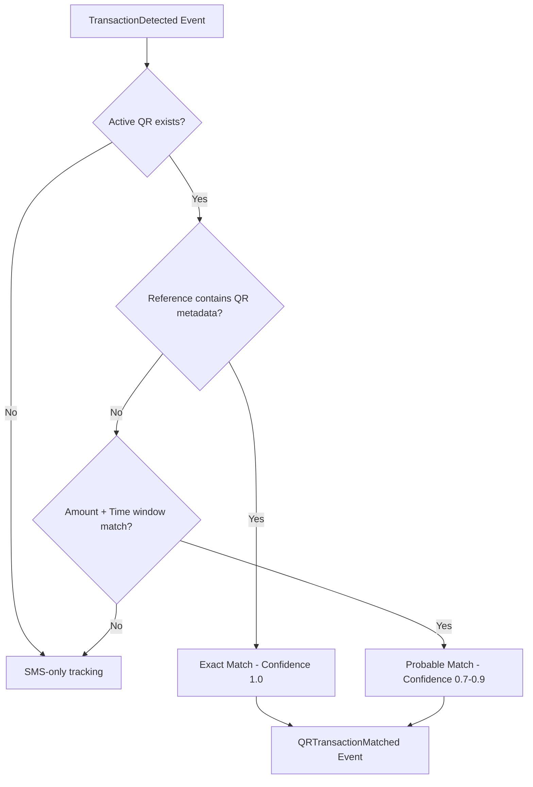

---

## 4. Swimlane Diagrams

### 4.1 SMS Processing Flow (Event-Modeled)

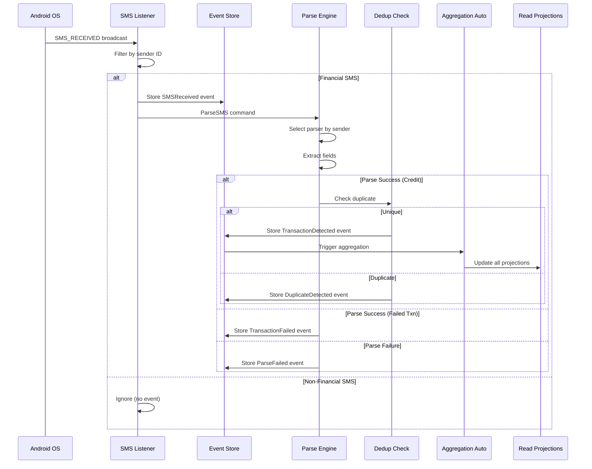

### 4.2 Daily Insight Generation

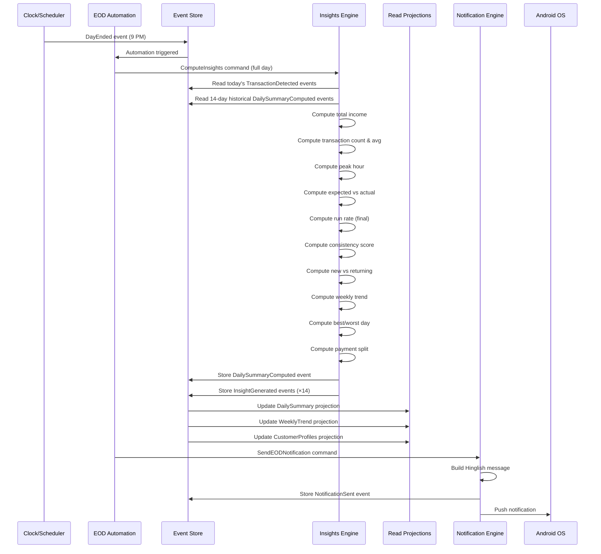

### 4.3 QR Payment Flow (V2)

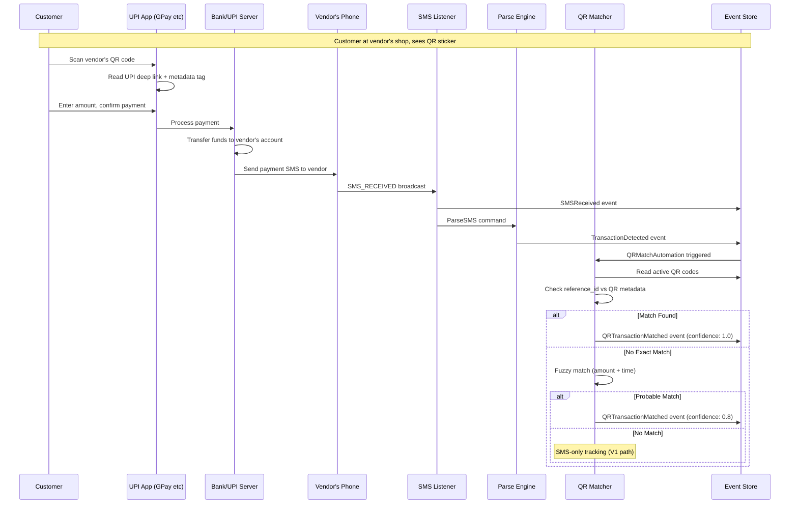

### 4.4 Onboarding Flow

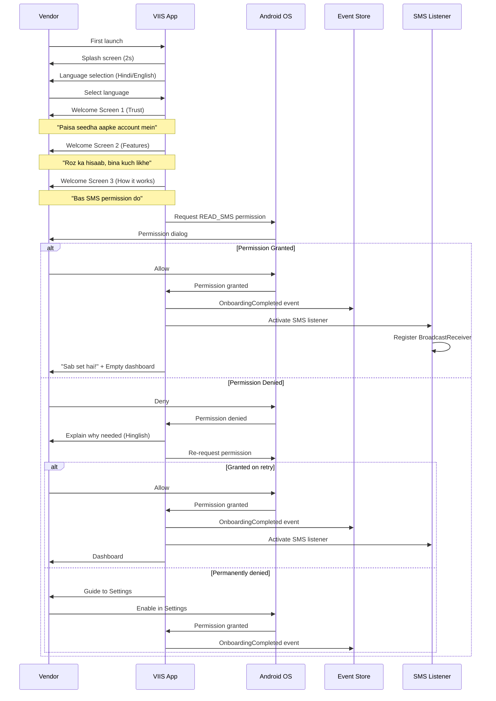

### 4.5 End-to-End Data Flow (Full Swimlane)

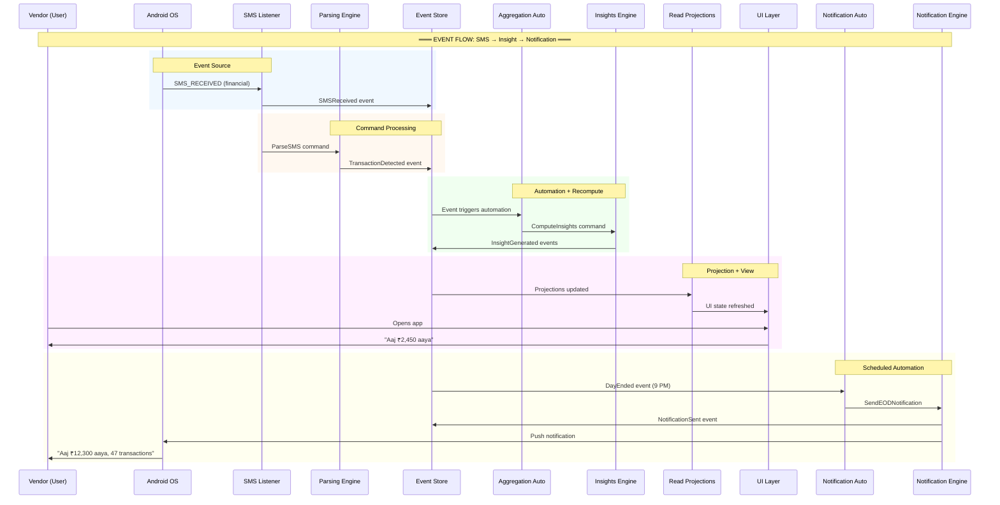

---

## 5. Tech Stack

### 5.1 Primary Stack

| Layer | Technology | Reason |
|---|---|---|
| Platform | Android (Kotlin) | SMS access requires native Android APIs |
| Min SDK | API 23 (Android 6.0) | Covers 95%+ of target devices |
| UI | Jetpack Compose | Simple card-based UI, minimal views |
| Local DB | Room (SQLite) | Event store + read model projections |
| Background | WorkManager | Reliable scheduling for EOD/mid-day jobs |
| DI | Hilt | Standard Android DI |
| Architecture | MVVM + Event Sourcing | Events as source of truth, ViewModels expose read models |
| QR (V2) | ZXing | Mature QR generation library |

### 5.2 Supporting Libraries

| Library | Purpose |
|---|---|
| Kotlin Coroutines + Flow | Async processing, reactive read model updates |
| Moshi / Kotlinx Serialization | JSON serialization for event payloads |
| Timber | Logging (no sensitive data) |
| Coil | Image loading (QR display) |

### 5.3 Optional Backend (Sync)

| Layer | Technology |
|---|---|
| API | FastAPI (Python) or Ktor (Kotlin) |
| Database | PostgreSQL |
| Hosting | Low-cost VPS or serverless |
| Sync Protocol | Delta sync (last_sync_timestamp based) |

### 5.4 Architecture Pattern

```
┌─────────────────────────────────────────┐
│                UI Layer                  │
│  (Compose Screens, ViewModels)          │
├─────────────────────────────────────────┤
│            Read Models Layer             │
│  (Projections: Daily, Hourly, Customer) │
├─────────────────────────────────────────┤
│           Domain Layer                   │
│  (Commands, Events, Automations)        │
├─────────────────────────────────────────┤
│           Event Store Layer              │
│  (Room DB — immutable event log)        │
├─────────────────────────────────────────┤
│          Infrastructure Layer            │
│  (SMS Listener, WorkManager, Sync)      │
└─────────────────────────────────────────┘
```

---

## 6. Data Flow Diagram

### 6.1 Complete Pipeline

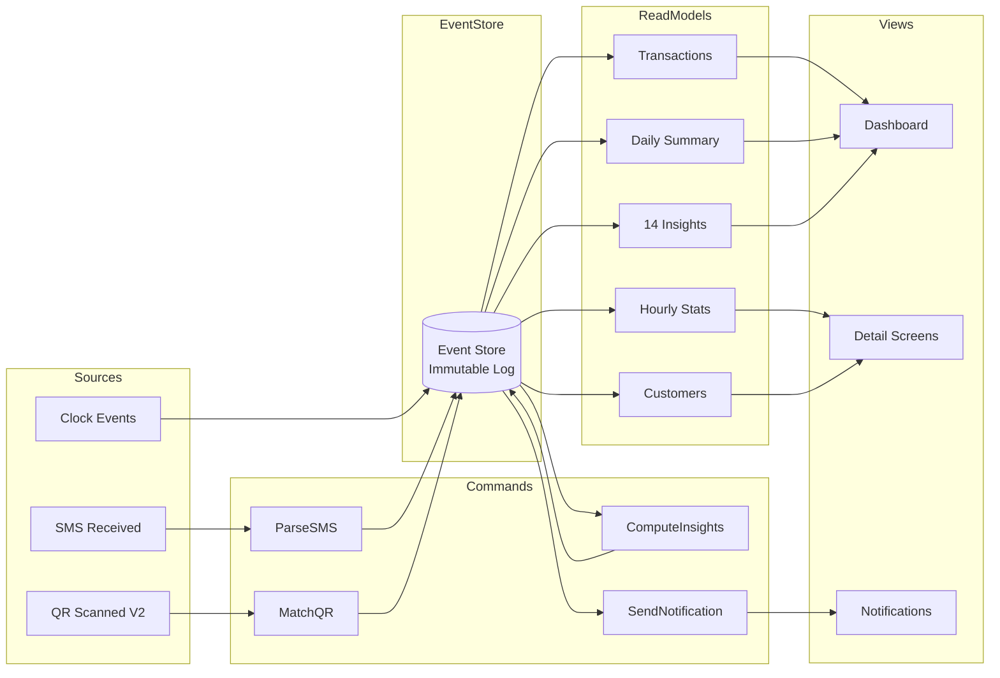

### 6.2 Real-Time Update Pipeline

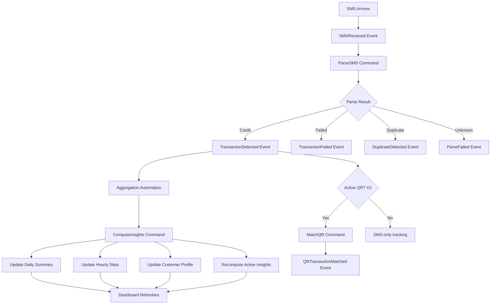

### 6.3 End-of-Day Batch Pipeline

```mermaid
flowchart TD
    A[9 PM — DayEnded Event] --> B[EOD Automation]
    B --> C[ComputeInsights - Full Day]
    C --> D[Read All Today's Events]
    D --> E[Read 14-Day Historical Events]

    E --> F[Compute All 14 Insights]
    F --> G[DailySummaryComputed Event]
    F --> H[14× InsightGenerated Events]

    G --> I[Update Read Models]
    H --> I

    B --> J[SendEODNotification Command]
    I --> J
    J --> K[Build Hinglish Message]
    K --> L[NotificationSent Event]
    L --> M[Push to Vendor]
