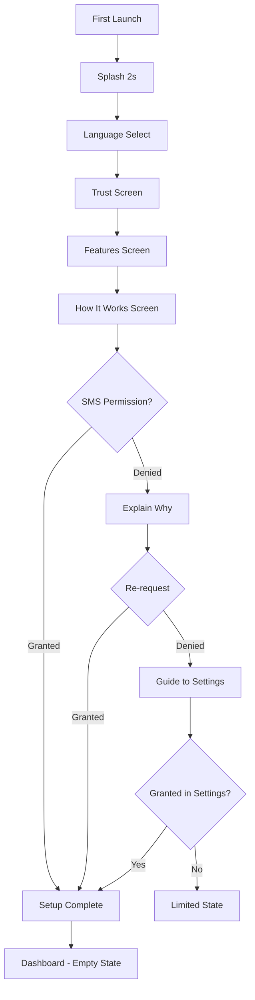

# User Flow 01: Onboarding / First Launch

## Description
First-time user experience when a vendor installs and opens VIIS. Builds trust, gets SMS permission, prepares for passive income tracking.

## Actor(s)
- **Vendor** — kirana store owner, street vendor, cart operator
- **Android OS** — permission dialogs

## Preconditions
- App freshly installed, Android 6.0+, device has SMS capability

## Trigger
User taps app icon for the first time.

## Steps

1. **Splash Screen** — "Roz Kamai" branding (2 seconds)
2. **Language Selection** — Hindi (default) / English toggle
3. **Welcome Screen 1 — Trust**: "Paisa seedha aapke account mein aata hai. Hum sirf payment messages padhte hain. Koi bank login nahi chahiye."
4. **Welcome Screen 2 — Features**: "Aapki digital kamai automatic track hogi. Roz ka hisaab, bina kuch likhe."
5. **Welcome Screen 3 — How It Works**: "Payment aayega → SMS aayega → Hum gin lenge. Bas SMS permission do."
6. **SMS Permission Request** — System dialog
   - Granted → Step 7
   - Denied → Exception Flow A
7. **Setup Complete**: "Sab set hai! Ab jaise hi payment aayega, hum track karenge."
8. **Main Dashboard** — Empty state: "Jaise hi UPI/bank payment aayega, yahan dikhega"

## Events Produced
- `OnboardingStarted { timestamp, language }`
- `PermissionGranted { permission: READ_SMS, timestamp }` or `PermissionDenied`
- `OnboardingCompleted { timestamp }`

## Postconditions
- SMS permission granted, listener active, user on dashboard

## Alternative/Exception Flows

### A: Permission Denied (First Time)
1. Explanation screen: "SMS permission kyun chahiye? Hum sirf bank/UPI messages padhte hain. Personal messages nahi. Data phone mein hi rehta hai."
2. Re-request → if denied again → Flow B

### B: Permanently Denied
1. "Settings mein jaake SMS permission on karein"
2. Button → opens app settings
3. On return, check → if granted, proceed

### C: App Killed Mid-Onboarding
- Resume from last incomplete step on next launch

### D: Android < 6.0
- Permission granted at install, skip permission step

## Mermaid Flowchart

## Acceptance Criteria
- [ ] Splash displays 1.5-2 seconds
- [ ] Language defaults to Hindi, persists across restarts
- [ ] All text in simple Hinglish, no jargon
- [ ] Trust messaging explicitly says "no bank login"
- [ ] Permission granted → SMS listener active immediately
- [ ] Onboarding < 5 taps happy path
- [ ] State persists if app killed mid-flow
- [ ] Works on Android 6.0+

## Edge Cases
| Case | Behavior |
|---|---|
| Kill app on screen 2 | Resume screen 2 on relaunch |
| No SIM device | Warning: "SMS ke liye SIM chahiye" |
| Android 13+ SMS restrictions | Appropriate permission flow |
| Switch language mid-onboarding | All content updates immediately |
| 2GB RAM device | No lag, no animations on welcome screens |
