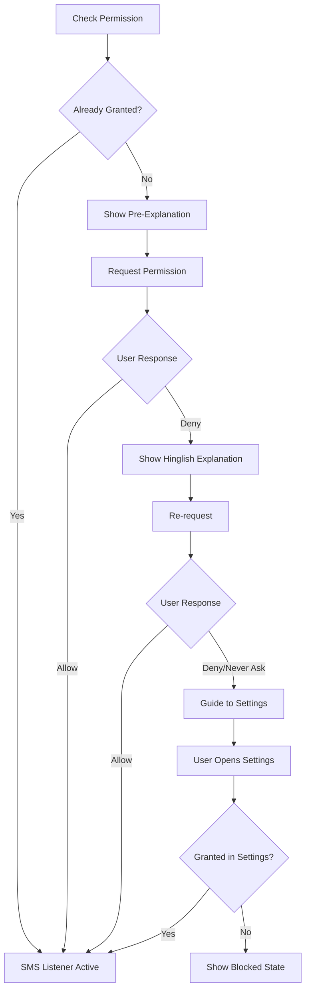

# User Flow 02: SMS Permission Grant

## Description
Handling the SMS read permission lifecycle — request, denial, explanation, re-request, permanent denial redirect.

## Actor(s)
- **Vendor**, **Android OS**

## Preconditions
- App installed, onboarding reached permission step (or app relaunched without permission)

## Trigger
App needs SMS permission and doesn't have it.

## Steps

1. App checks `READ_SMS` permission status
2. If not granted, show pre-request explanation: "Aapke phone ke payment messages padhne ke liye permission chahiye"
3. Call `requestPermissions(READ_SMS)`
4. Android shows system dialog
5. User taps "Allow" → permission granted → activate SMS listener → produce `PermissionGranted` event
6. User taps "Deny" → show Hinglish explanation → re-request (one retry)
7. User taps "Don't ask again" / permanent deny → guide to Settings with button

## Events Produced
- `PermissionGranted { permission, timestamp }`
- `PermissionDenied { permission, timestamp, isPermanent }`

## Postconditions
- Permission granted: SMS listener registered and active
- Permission denied: App shows explanation / settings guide

## Alternative/Exception Flows

### A: Permission Already Granted (re-launch)
- Skip to dashboard, listener already active

### B: Permission Revoked by User (in Settings after initial grant)
- On next app open, detect revocation, re-request with explanation

### C: Custom ROM Blocking SMS Category
- Detect failure, show: "Aapke phone mein SMS permission ka issue hai. Settings → Apps → Roz Kamai → Permissions → SMS allow karein"

## Mermaid Flowchart

## Acceptance Criteria
- [ ] Pre-explanation shown before system dialog
- [ ] Explanation uses simple Hinglish
- [ ] One retry after first denial
- [ ] Permanent denial → Settings redirect with instructions
- [ ] Permission grant immediately activates listener
- [ ] Permission revocation detected on next app open
- [ ] No crash on any permission state

## Edge Cases
| Case | Behavior |
|---|---|
| Android 13+ granular SMS permission | Use correct permission API |
| User grants then revokes in Settings | Detect on resume, re-request |
| Split-screen / multi-window permission dialog | Handle configuration change |
| Very fast allow (< 100ms) | Still register listener correctly |
