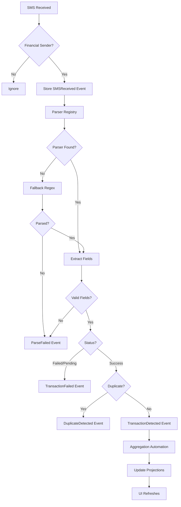

# User Flow 03: SMS Detection & Parsing

## Description
Core flow: financial SMS arrives → detected → parsed → validated → deduplicated → stored as event → projections updated.

## Actor(s)
- **Android OS** (delivers SMS), **SMS Listener**, **Parsing Engine**, **Event Store**, **Aggregation Automation**

## Preconditions
- SMS permission granted, BroadcastReceiver registered

## Trigger
New SMS received on device.

## Steps

1. Android OS delivers `SMS_RECEIVED` broadcast
2. SMS Listener receives broadcast, reads sender ID and body
3. Filter: Check sender ID against financial sender list (AD-GPAY, AD-SBIINB, etc.)
   - Non-financial → ignore, no event
   - Financial → continue
4. Store `SMSReceived` event (raw body preserved)
5. Route to Parser Registry → select parser by sender ID
6. Parser extracts: amount, sender_name, upi_handle, timestamp, source, reference_id, status
7. Validate extracted fields (amount > 0, valid timestamp, known status)
8. Check transaction status:
   - FAILED/DECLINED/PENDING → produce `TransactionFailed` event → END
   - SUCCESS → continue
9. Deduplication check (amount + sender + 5-min window, or exact reference_id match)
   - Duplicate → produce `DuplicateDetected` event → END
   - Unique → continue
10. Produce `TransactionDetected` event
11. Aggregation automation triggers → update all read model projections
12. UI refreshes automatically via Flow observation

## Events Produced
- `SMSReceived { rawBody, senderId, timestamp }`
- `TransactionDetected { amount, senderName, upiHandle, timestamp, source, referenceId }` OR
- `TransactionFailed { amount, reason, timestamp }` OR
- `DuplicateDetected { originalEventId, duplicateBody }` OR
- `ParseFailed { rawBody, reason }`

## Postconditions
- Event stored in immutable log
- Read model projections updated (if TransactionDetected)
- Dashboard reflects new transaction

## Alternative/Exception Flows

### A: Unknown SMS Format
- Fallback regex parser attempts extraction
- If fails → `ParseFailed` event with raw body and reason
- SMS logged for future parser development

### B: Malformed Amount
- Parser returns `ParseFailed` with reason "invalid_amount"
- No transaction created

### C: Regional Language SMS
- Attempt parsing with known patterns
- Fall back to amount-extraction heuristic (₹/Rs./INR + number)

## Mermaid Flowchart

## Acceptance Criteria
- [ ] Only financial SMS processed (sender ID filter)
- [ ] SMSReceived event stored before parsing
- [ ] Correct parser selected by sender ID
- [ ] All fields extracted accurately (≥90% for supported sources)
- [ ] Deduplication catches same-transaction duplicates
- [ ] Failed transactions produce TransactionFailed event
- [ ] Unknown formats produce ParseFailed event (no crash)
- [ ] Parse latency < 1 second
- [ ] Dashboard updates immediately after new transaction
- [ ] Works completely offline

## Edge Cases
| Case | Behavior |
|---|---|
| Two SMS within 1 second | Process both, dedup catches if same txn |
| SMS > 500 characters | Likely non-transactional, log as ParseFailed |
| Amount = ₹0.01 | Process normally (valid small transaction) |
| Multi-part SMS | Concatenate parts before parsing |
| SMS during app update | BroadcastReceiver catches, queues for processing |
