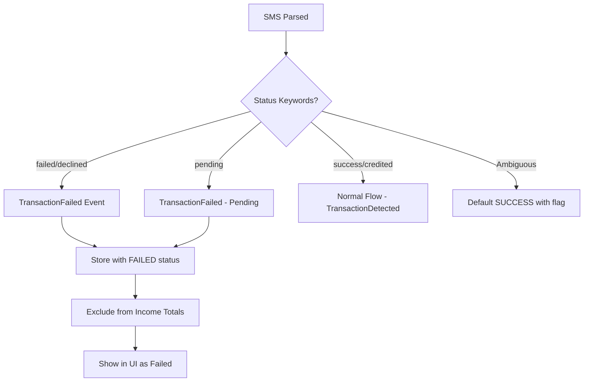

# User Flow 04: Failed Transaction Handling

## Description
Detecting and correctly handling failed, declined, or pending payment SMS — ensuring they don't inflate income totals.

## Actor(s)
- **Parsing Engine**, **Event Store**

## Preconditions
- Financial SMS received and routed to parser

## Trigger
Parser identifies failure keywords in SMS (failed, declined, pending, unsuccessful, not completed).

## Steps

1. Parser extracts transaction data including status keywords
2. Status classification: detect "failed", "declined", "unsuccessful", "not completed", "pending", "timed out"
3. Produce `TransactionFailed` event with amount (if available) and reason
4. Transaction stored in projection with status = FAILED/PENDING
5. Excluded from all income totals, averages, and insights
6. Visible in UI with clear "Failed" / "Pending" label and distinct styling (grey/red)

## Events Produced
- `TransactionFailed { amount, senderName, timestamp, reason, originalStatus }`

## Postconditions
- Failed transaction recorded but excluded from income projections
- No impact on daily total, hourly stats, customer metrics
- Visible in transaction history with clear failed status

## Alternative/Exception Flows

### A: Pending → Later Success (Two SMS)
1. First SMS: "Payment pending" → `TransactionFailed { status: PENDING }`
2. Second SMS: "Payment successful" → `TransactionDetected` (normal flow)
3. Dedup check: different status = NOT a duplicate → both events stored
4. Only the success event counts toward income

### B: Ambiguous Status
- If status cannot be determined, default to SUCCESS (optimistic)
- Flag for review in ParseFailed metadata

## Mermaid Flowchart

## Acceptance Criteria
- [ ] Failed keywords detected: failed, declined, unsuccessful, not completed, timed out
- [ ] Pending keywords detected: pending, processing, initiated
- [ ] Failed transactions excluded from ALL income calculations
- [ ] Failed transactions visible in UI with distinct styling
- [ ] Pending → success scenario handled correctly (no double count)
- [ ] TransactionFailed event contains reason for failure

## Edge Cases
| Case | Behavior |
|---|---|
| "Failed" in sender name, not status | Context-aware parsing, check full SMS pattern |
| Partial failure ("₹500 of ₹1000 failed") | Parse as two events if possible, or ParseFailed |
| Repeated failure SMS for same txn | Dedup catches within window |
