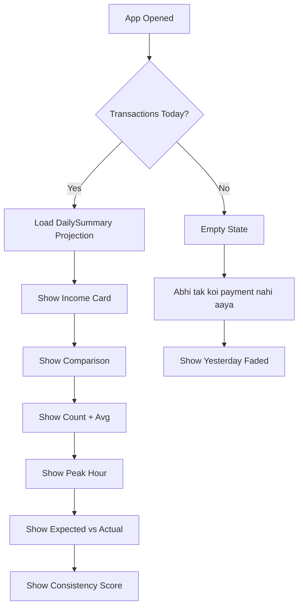

# User Flow 05: Daily Summary View

## Description
Primary app experience — vendor opens app and sees today's income at a glance with key metrics.

## Actor(s)
- **Vendor** (opens app)

## Preconditions
- App installed, SMS permission granted, at least one transaction today (or show empty state)

## Trigger
Vendor opens the app.

## Steps

1. App opens → dashboard loads from DailySummary read model projection
2. **Primary Card**: "Aaj ₹12,350 aaya" (large text, prominent)
3. **Comparison**: "Kal se ₹2,100 zyada" (green) or "Kal se ₹1,500 kam" (red)
4. **Transaction Count**: "42 transactions"
5. **Average Sale**: "Avg ₹294"
6. **Peak Hour**: "Peak time: 6-7 PM"
7. **Expected vs Actual**: "₹10,000 expected tha, ₹12,350 aaya" (ahead indicator)
8. **Consistency Score**: "Score: 85/100 — Achha din!"
9. All data auto-refreshes when new TransactionDetected event arrives

## Events Produced
- `AppOpened { timestamp }` (for analytics)

## Postconditions
- Vendor sees current day's income summary
- Data is real-time (updates without manual refresh)

## Alternative/Exception Flows

### A: No Transactions Today
- "Aaj abhi tak koi digital payment nahi aaya"
- Show yesterday's summary faded: "Kal ₹X aaya tha"

### B: First Day (No Historical Data)
- Show income total only
- Hide comparison, expected, consistency (insufficient data)
- "Jaise jaise data badhega, aur insights milenge"

### C: App Opened After Midnight (Yesterday's Summary)
- Show today (empty/partial) with yesterday's full summary accessible

## Mermaid Flowchart

## Acceptance Criteria
- [ ] "Aaj ₹X aaya" is the first and largest element on screen
- [ ] Amount uses Indian number format (₹1,23,456)
- [ ] Comparison shows zyada (green) or kam (red) correctly
- [ ] All metrics update in real-time via Flow
- [ ] Empty state is clear and helpful
- [ ] First-day experience hides unavailable insights gracefully
- [ ] Dashboard loads in < 1 second
- [ ] No financial jargon anywhere
- [ ] Works on 2-3GB RAM devices without lag

## Edge Cases
| Case | Behavior |
|---|---|
| Exactly same as yesterday | "Kal jitna hi aaya" (neutral color) |
| Only 1 transaction today | Show all available metrics, skip avg |
| ₹0 income (all failed txns) | "Aaj ₹0 aaya" with note about failed transactions |
| Very large amount (₹5,00,000+) | Display scales, no overflow |
