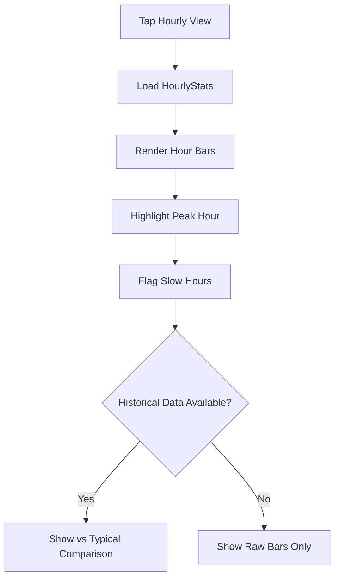

# User Flow 06: Hourly Breakdown

## Description
Detailed hour-by-hour income distribution for the current day, showing when peak and slow periods occurred.

## Actor(s)
- **Vendor**

## Preconditions
- At least 1 transaction today

## Trigger
Vendor taps "Hourly" section or expands hourly card on dashboard.

## Steps

1. Load HourlyStats projection for today
2. Display hour blocks (6 AM - 11 PM typical) as simple horizontal bars
3. Each bar shows: hour range + amount + transaction count
4. **Peak hour highlighted** (green/bold): "6-7 PM: ₹3,200 (12 txns) — PEAK"
5. **Slow hours flagged** (if below historical avg by 30%+): "2-3 PM: ₹400 — Slow"
6. **Idle gaps** highlighted: "11 AM - 1 PM: koi payment nahi aaya"
7. Compare with typical pattern for this weekday (if 14+ days data)

## Events Produced
- None (read-only view)

## Postconditions
- Vendor understands their earning pattern through the day

## Mermaid Flowchart

## Acceptance Criteria
- [ ] Shows 1-hour blocks for active hours only
- [ ] Peak hour clearly marked (different color/bold)
- [ ] Slow hours flagged with indicator
- [ ] Idle gaps shown explicitly
- [ ] Simple bar visualization (no complex charts)
- [ ] Historical comparison when enough data (14+ days)
- [ ] Large text, readable on small screens
- [ ] Updates in real-time as new transactions arrive

## Edge Cases
| Case | Behavior |
|---|---|
| Only 1 transaction at 8 AM | Show single bar, no peak/slow analysis |
| All transactions in 1 hour | That hour = peak, others are idle |
| Midnight transaction (12-1 AM) | Include in today's view |
| Shop opened at 2 PM (late start) | Show hours from 2 PM only |
