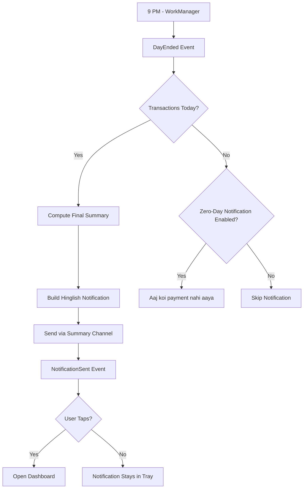

# User Flow 07: End-of-Day Notification

## Description
Automated daily summary notification sent at 9 PM with the day's income and key highlights.

## Actor(s)
- **Notification Engine**, **Android OS**, **Vendor** (receives notification)

## Preconditions
- At least 1 transaction today, notification permission granted, 9 PM reached

## Trigger
`DayEnded` event produced by clock scheduler at 9 PM.

## Steps

1. WorkManager fires EOD job at 9 PM
2. System produces `DayEnded` event
3. EOD Automation triggers → compute final daily summary
4. Build notification text:
   - "Aaj ₹12,350 aaya, 42 transactions"
   - "Kal se ₹2,100 zyada"
   - "Peak time: 6-7 PM"
5. Send push notification via Summary channel
6. Produce `NotificationSent` event
7. User taps notification → opens app to full daily summary

## Events Produced
- `DayEnded { date }`
- `DailySummaryComputed { ... }` (if not already computed)
- `NotificationSent { type: EOD_SUMMARY, title, body }`

## Postconditions
- Vendor sees day's summary without opening app
- Tap opens full dashboard view

## Alternative/Exception Flows

### A: No Transactions Today
- Skip notification OR send: "Aaj koi digital payment nahi aaya"
- Configurable: vendor can choose to get notified even on zero days

### B: Phone Off at 9 PM
- WorkManager delivers when phone turns on (exact timing not guaranteed)

### C: DND Mode Active
- Summary channel is default importance → respects DND
- Notification delivered silently, visible when DND ends

## Mermaid Flowchart

## Acceptance Criteria
- [ ] Notification fires at 9 PM (± 15 min due to WorkManager)
- [ ] Hinglish text with ₹ amount and transaction count
- [ ] Includes day-over-day comparison
- [ ] Tap opens app to daily summary
- [ ] Survives device restart (re-scheduled on boot)
- [ ] NotificationSent event logged
- [ ] Respects DND mode
- [ ] No battery drain from notification scheduling

## Edge Cases
| Case | Behavior |
|---|---|
| Phone restarted at 8:55 PM | WorkManager re-schedules, fires at 9 PM |
| App force-killed | WorkManager still fires (system-level) |
| Timezone change during day | Use device local time |
| User in different timezone than usual | Use current device timezone |
