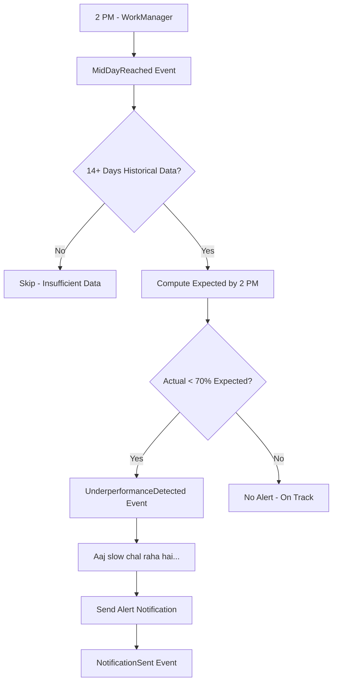

# User Flow 08: Mid-Day Alert

## Description
Alert sent at 2 PM when vendor's actual earnings are significantly below expected, helping them notice slow days early.

## Actor(s)
- **Notification Engine**, **Insights Engine**, **Vendor**

## Preconditions
- At least 14 days of historical data (for meaningful baseline), 2 PM reached, mid-day alerts enabled

## Trigger
`MidDayReached` event at 2 PM → automation checks actual vs expected.

## Steps

1. WorkManager fires mid-day check at 2 PM
2. Produce `MidDayReached` event
3. Compute expected earnings by 2 PM (14-day same-weekday avg at this hour)
4. Compare with actual earnings so far
5. If actual < 70% of expected (30%+ deficit):
   - Produce `UnderperformanceDetected` event
   - Build alert: "Aaj slow chal raha hai. Ab tak ₹3,200 aaya, ₹5,500 expected tha."
   - Send via Alerts channel (high importance)
   - Produce `NotificationSent` event
6. If actual ≥ 70% of expected → no alert

## Events Produced
- `MidDayReached { date, time }`
- `UnderperformanceDetected { expected, actual, deficit }` (conditional)
- `NotificationSent { type: MIDDAY_ALERT }` (conditional)

## Postconditions
- Vendor aware of underperformance (if any), can take action (e.g., check QR visibility, adjust)

## Alternative/Exception Flows

### A: Insufficient Historical Data
- Skip alert entirely
- No notification, no UnderperformanceDetected event

### B: Vendor Closed Today (Holiday)
- System doesn't know it's a holiday
- Alert may fire incorrectly — acceptable in V1
- Future: vendor can mark "aaj dukaan band hai"

### C: Extremely Good Day (> 130% expected)
- No alert (only alerts on underperformance)
- Future enhancement: positive milestone notification

## Mermaid Flowchart

## Acceptance Criteria
- [ ] Fires at 2 PM (configurable via 2-way door decision)
- [ ] Only fires when actual < 70% expected
- [ ] Requires 14+ days data for baseline (no false alerts for new users)
- [ ] Uses Alerts channel (high importance — can break DND)
- [ ] Hinglish text with specific ₹ amounts
- [ ] UnderperformanceDetected event logged
- [ ] Tap opens expected vs actual view

## Edge Cases
| Case | Behavior |
|---|---|
| Exactly 70% of expected | No alert (threshold is <70%) |
| Expected is ₹0 (no historical 2 PM data) | Skip alert |
| Festival day (abnormally high yesterday) | Baseline averages over 14 days, dampens outliers |
| Only 1 transaction worth ₹50,000 (large order) | Alert still fires correctly on ₹ amounts |
