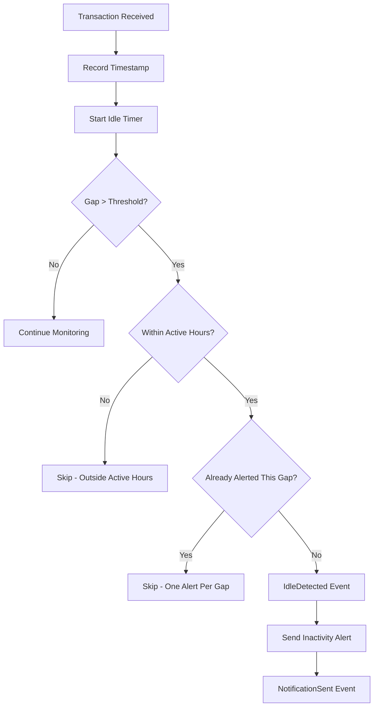

# User Flow 09: Inactivity Alert

## Description
Alert when no transactions detected for an unusually long period during typical active hours.

## Actor(s)
- **Alert Automation**, **Vendor**

## Preconditions
- At least 7 days data (for dynamic threshold), currently within vendor's typical active hours

## Trigger
Gap between last `TransactionDetected` and current time exceeds dynamic threshold.

## Steps

1. On each `TransactionDetected` event, record timestamp
2. Idle monitor checks gap since last transaction periodically
3. Dynamic threshold = max(2 hours default, avg_gap × 2.5)
4. If gap > threshold AND within typical active hours (based on historical first/last sale times):
   - Produce `IdleDetected` event
   - Send alert: "Koi payment nahi aaya 3 ghante se. Sab theek hai?"
   - Produce `NotificationSent` event
5. Only one inactivity alert per idle period (reset on next transaction)

## Events Produced
- `IdleDetected { gapDuration, lastTxnTime, threshold }`
- `NotificationSent { type: INACTIVITY_ALERT }`

## Postconditions
- Vendor aware of unusual inactivity, can check if QR is visible, device is working, etc.

## Mermaid Flowchart

## Acceptance Criteria
- [ ] Default threshold: 2 hours
- [ ] Dynamic threshold: avg_gap × 2.5 (after 7 days data)
- [ ] Only alerts during vendor's active hours
- [ ] Only one alert per idle period
- [ ] Hinglish text with duration
- [ ] Resets on next transaction
- [ ] IdleDetected event logged with gap details

## Edge Cases
| Case | Behavior |
|---|---|
| Vendor's shop closed for lunch (regular pattern) | Dynamic threshold learns this gap, doesn't alert |
| Sunday (closed) | Outside active hours → no alert |
| Phone turned off for 4 hours | Alert when phone turns back on if within active hours |
| Vendor only gets 2-3 txns/day | Very high threshold, rarely alerts |
