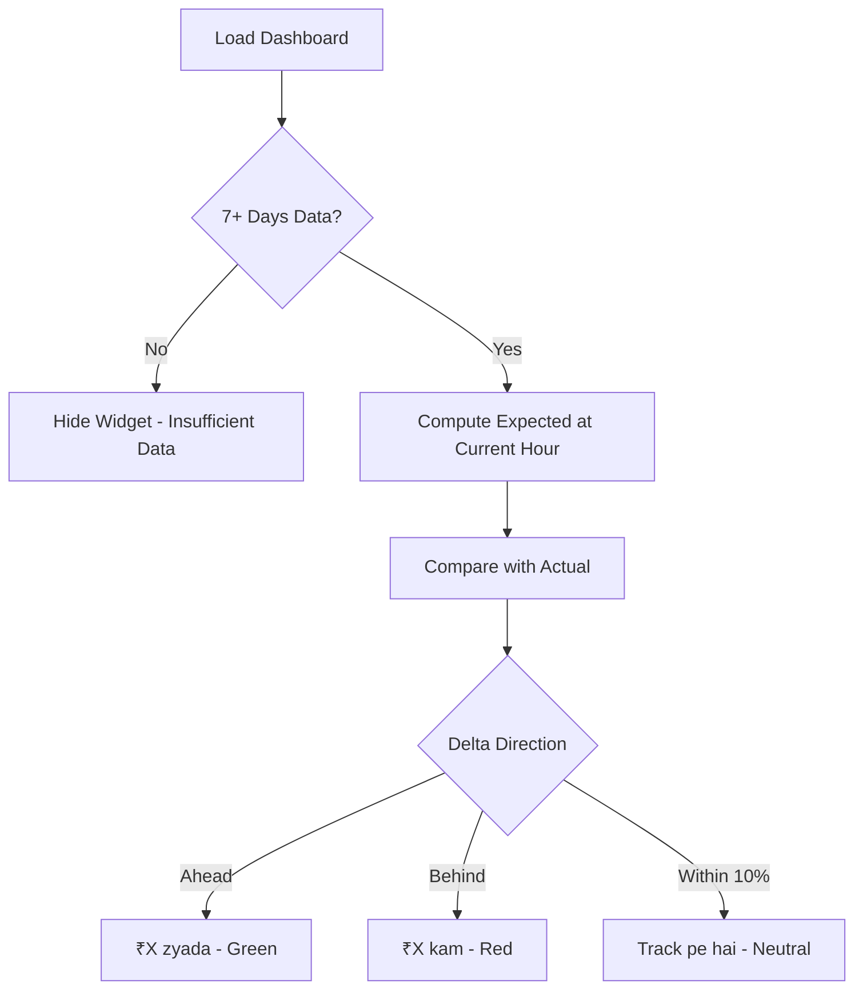

# User Flow 10: Expected vs Actual Earnings

## Description
Dashboard widget showing how today's income compares to what was expected based on historical patterns.

## Actor(s)
- **Vendor** (views dashboard)

## Preconditions
- At least 7 days of data for meaningful baseline (14 days ideal)

## Trigger
Vendor opens app or new transaction arrives (auto-refresh).

## Steps

1. Load historical DailySummary projections for same weekday (last 14 days)
2. Compute expected income at current hour: rolling avg of same-weekday income at this hour
3. Display: "Ab tak ₹5,500 aana chahiye tha, ₹7,200 aaya"
4. Color coding: green = ahead, red = behind, neutral = within 10%
5. Show delta: "₹1,700 zyada" (green) or "₹2,300 kam" (red)
6. Updates in real-time as new transactions and time progress

## Events Produced
- `InsightGenerated { type: EXPECTED_EARNINGS, expected, actual, delta }`

## Postconditions
- Vendor understands if today is tracking above or below normal

## Mermaid Flowchart

## Acceptance Criteria
- [ ] Uses 14-day rolling same-weekday average
- [ ] Falls back to all-day average if < 14 same-weekday data points
- [ ] Hidden when < 7 days total data
- [ ] Green/red/neutral color coding
- [ ] Shows both expected and actual amounts
- [ ] Updates in real-time
- [ ] Simple language: "aana chahiye tha" / "aaya"

## Edge Cases
| Case | Behavior |
|---|---|
| Monday but only 1 historical Monday | Use that + weighted all-day average |
| Very early morning (6 AM, expected ₹0) | "Abhi expected ₹0 hai" or hide |
| Festival week skewed history | 14-day avg dampens single outlier |
| New month after month-end spike | Rolling avg adjusts gradually |
