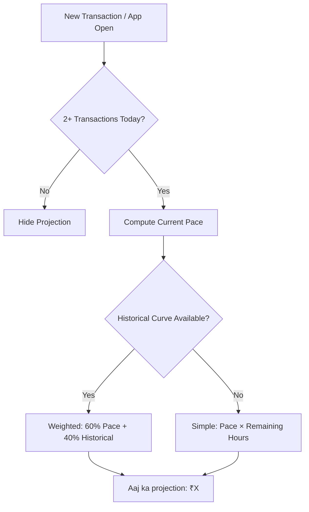

# User Flow 11: Run Rate Projection

## Description
Real-time projection of end-of-day earnings based on current pace and historical daily patterns.

## Actor(s)
- **Vendor** (views dashboard)

## Preconditions
- At least 2 transactions today, some historical data

## Trigger
New transaction or app opened.

## Steps

1. Calculate current pace: total_so_far / hours_elapsed_today
2. Load historical daily curve for same weekday (what % of daily income comes in each hour)
3. Weighted projection: 60% current_pace × remaining_hours + 40% historical_curve_prediction
4. Display: "Aaj ka projection: ₹15,200"
5. Update with every new transaction
6. Show confidence indicator if historical data is limited

## Events Produced
- `InsightGenerated { type: RUN_RATE, projectedTotal, currentTotal, confidence }`

## Postconditions
- Vendor has expectation of where the day is heading

## Mermaid Flowchart

## Acceptance Criteria
- [ ] Shows only after 2+ transactions today
- [ ] Uses weighted formula (60/40 pace/historical)
- [ ] Updates in real-time with each transaction
- [ ] Reasonable projection (not wildly off from historical range)
- [ ] Simple display: single projected number
- [ ] Falls back to simple extrapolation without historical data

## Edge Cases
| Case | Behavior |
|---|---|
| Single ₹50,000 transaction at 8 AM | Projection very high — historical curve dampens it |
| Very slow morning, typical rush at 6 PM | Historical curve adjusts upward for evening |
| Already past typical closing time | Use actual total, minimal extrapolation |
| Only 30 minutes of data | Hide or show with low confidence |
