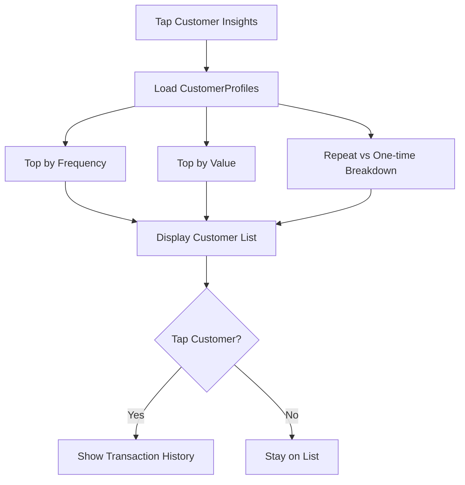

# User Flow 12: Repeat Customer View

## Description
Customer insights showing top repeat customers by frequency and value, helping vendor understand their regular base.

## Actor(s)
- **Vendor**

## Preconditions
- Customer profiles built from transaction history (needs UPI handle or name data)

## Trigger
Vendor taps customer insights section.

## Steps

1. Load CustomerProfiles projection
2. **Top by Frequency**: "Ramesh ji — 15 baar aaye" (list top 5-10)
3. **Top by Value**: "Sharma ji — ₹12,500 total" (list top 5-10)
4. **Repeat vs One-time**: "32 regular, 18 kabhi kabhi, 95 ek baar"
5. **Today's Breakdown**: "Aaj 3 purane customer aaye, 5 naye"
6. Tap on customer → see their transaction history (amount, date, time)

## Events Produced
- None (read-only view)

## Postconditions
- Vendor knows who their regular customers are

## Mermaid Flowchart

## Acceptance Criteria
- [ ] Top customers ranked by frequency and by value (separate lists)
- [ ] Customer names from UPI handle or SMS sender name
- [ ] Repeat = 2+ transactions, Regular = 5+ in 30 days
- [ ] Today's new vs returning breakdown shown
- [ ] Tap shows individual customer history
- [ ] Handles anonymous/unknown customers gracefully
- [ ] Privacy-conscious (no raw UPI handles shown to user)

## Edge Cases
| Case | Behavior |
|---|---|
| All anonymous (no names/UPI handles) | Show "Unknown Customer 1, 2..." or hide section |
| Common name "Rahul" = multiple people | Cluster by UPI handle first, name is display only |
| Customer's UPI handle changes | Treated as new customer (no way to link) |
| First week, all customers are "new" | "Abhi sab naye hain, thode din mein repeat customers dikhenge" |
