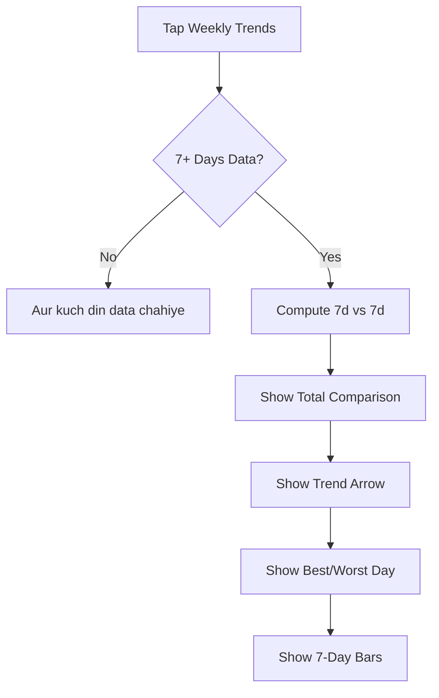

# User Flow 13: Weekly Trends

## Description
Rolling 7-day income comparison with previous 7 days, plus best/worst day identification.

## Actor(s)
- **Vendor**

## Preconditions
- Minimum 7 days of transaction data

## Trigger
Vendor taps weekly trends section.

## Steps

1. Load DailySummary projections for last 14 days
2. **This Week vs Last Week**: "Is hafte ₹85,000 aaya. Pichle hafte se ₹12,000 zyada (+16%)"
3. **Trend Arrow**: ↑ up (>5%), ↓ down (<-5%), → flat (±5%)
4. **Best Day**: "Sabse achha din: Shanivar (avg ₹14,500)"
5. **Worst Day**: "Sabse kam: Somvar (avg ₹8,200)"
6. **Daily Bars**: Simple 7-day bar view showing each day's total

## Events Produced
- `InsightGenerated { type: WEEKLY_TREND, thisWeek, lastWeek, delta, bestDay, worstDay }`

## Postconditions
- Vendor understands weekly earning trajectory

## Mermaid Flowchart

## Acceptance Criteria
- [ ] Rolling 7-day comparison (not calendar week)
- [ ] Shows absolute delta and percentage
- [ ] Trend: up (>5%), down (<-5%), flat (±5%)
- [ ] Best/worst day computed from 28-day weekday averages
- [ ] Day names in Hinglish: Somvar, Mangalvar, Budhvar, etc.
- [ ] Hidden when < 7 days data
- [ ] Simple bar visualization, no complex charts

## Edge Cases
| Case | Behavior |
|---|---|
| Only 8 days of data | Compare 7d vs available 1d — show with caveat |
| One massive outlier day | Included in average — noted if > 3× avg |
| Week with a day off (0 income) | Included as ₹0 day — lowers average |
| All days roughly equal | "Har din lagbhag barabar" |
