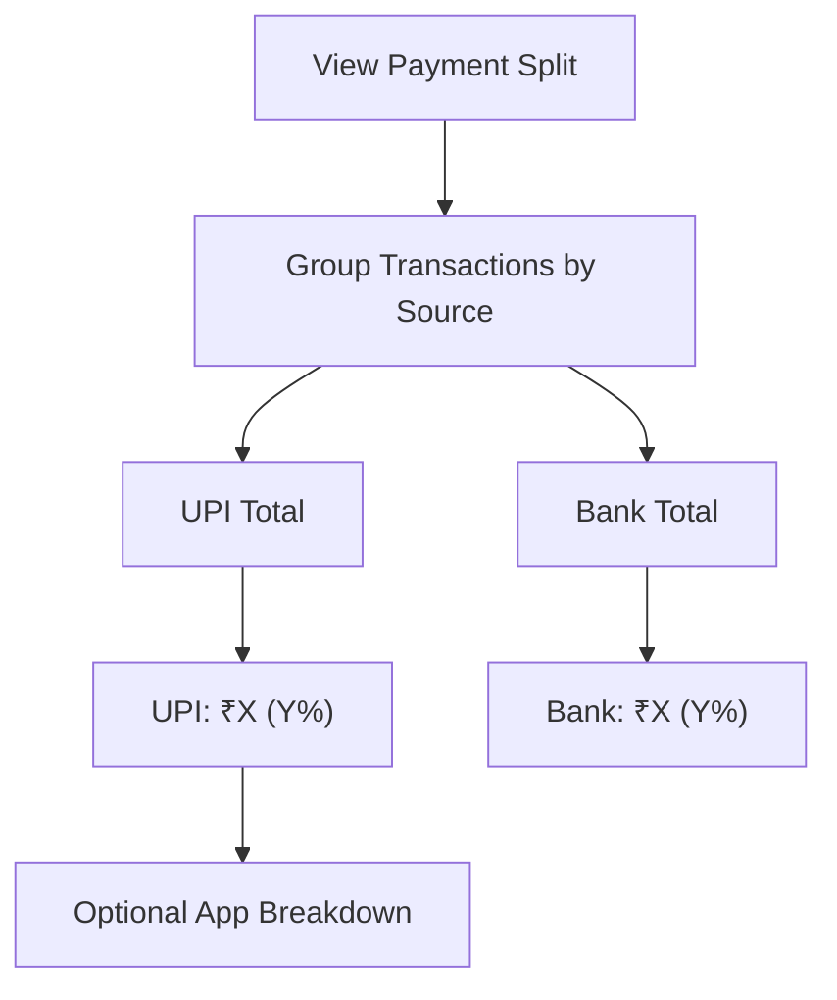

# User Flow 14: Payment Method Split

## Description
Breakdown of income by payment method — UPI vs bank transfer — based on SMS source classification.

## Actor(s)
- **Vendor**

## Preconditions
- At least 1 transaction today

## Trigger
Vendor views payment breakdown section on dashboard.

## Steps

1. Load transactions grouped by source (UPI, NEFT, IMPS, BANK)
2. **Simplified View**: UPI (GPay + PhonePe + Paytm) vs Bank Transfer (NEFT + IMPS)
3. Display: "UPI: ₹10,500 (85%) | Bank: ₹1,850 (15%)"
4. Show transaction counts per method
5. Optional: sub-breakdown by app (GPay: 60%, PhonePe: 20%, Paytm: 5%)

## Events Produced
- `InsightGenerated { type: PAYMENT_SPLIT, upiAmount, bankAmount, upiCount, bankCount }`

## Postconditions
- Vendor understands which payment methods customers use most

## Mermaid Flowchart

## Acceptance Criteria
- [ ] Groups into UPI vs Bank Transfer (simplified)
- [ ] Shows amounts and percentages
- [ ] Shows transaction counts per method
- [ ] Based on SMS source identification from parser
- [ ] Simple display — two sections, no pie charts

## Edge Cases
| Case | Behavior |
|---|---|
| All UPI, no bank transfers | "Sab UPI se aaya" — 100% UPI |
| Unknown source classification | Category: "Other" |
| Only 1 transaction | Still show split (100% one type) |
