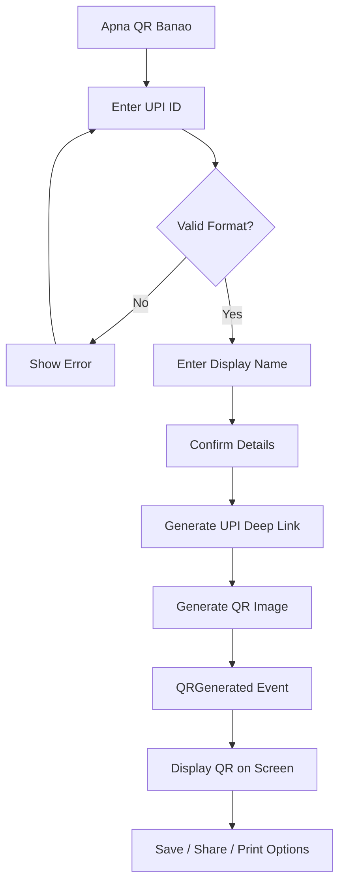

# User Flow 15: QR Code Generation (V2)

## Description
Vendor generates their personal UPI QR code within the app, with embedded metadata for enhanced transaction tracking.

## Actor(s)
- **Vendor**

## Preconditions
- V2 features enabled, vendor has a UPI ID

## Trigger
Vendor taps "Apna QR banao" button.

## Steps

1. **Enter UPI ID**: Text field with example "yourname@upi"
2. **Enter Display Name**: Pre-filled if available from SMS data
3. **Confirm**: "Kya yeh aapka UPI ID hai? {upi_id}"
4. Generate UPI deep link: `upi://pay?pa={upi_id}&pn={name}&tr={metadata}&cu=INR`
5. Generate QR image from deep link (ZXing)
6. Produce `QRGenerated` event
7. **Display QR**: Large on screen with vendor name below
8. **Action buttons**: "Save", "Share", "Print"

## Events Produced
- `QRGenerated { qrId, upiId, vendorName, metadataTag, timestamp }`

## Postconditions
- QR code generated and saved in app
- QR linked to vendor's UPI ID with tracking metadata
- QR ready for printing/sharing

## Alternative/Exception Flows

### A: Invalid UPI ID Format
- Show error: "UPI ID sahi format mein daalen (example@upi)"
- Don't generate QR

### B: Vendor Has Multiple UPI IDs
- Allow generating separate QR for each
- Track which QR each transaction matches

### C: Vendor Changes UPI ID
- Generate new QR, keep old one for reference
- Old QR still works for payments (UPI link is direct)

## Mermaid Flowchart

## Acceptance Criteria
- [ ] UPI ID validation (format check)
- [ ] QR encodes valid UPI deep link
- [ ] Metadata tag embedded in `tr` parameter
- [ ] QR works with GPay, PhonePe, Paytm (tested)
- [ ] QR displayed large and clear on screen
- [ ] QRGenerated event stored
- [ ] Save/share/print options available
- [ ] Simple flow: 3 taps from start to QR

## Edge Cases
| Case | Behavior |
|---|---|
| UPI ID with special characters | Validate, URL-encode in deep link |
| Very long vendor name | Truncate in QR, show full elsewhere |
| No internet (QR generation is local) | Works offline — QR is just an encoded string |
| Regenerate QR | New metadata tag, old QR still functional |
