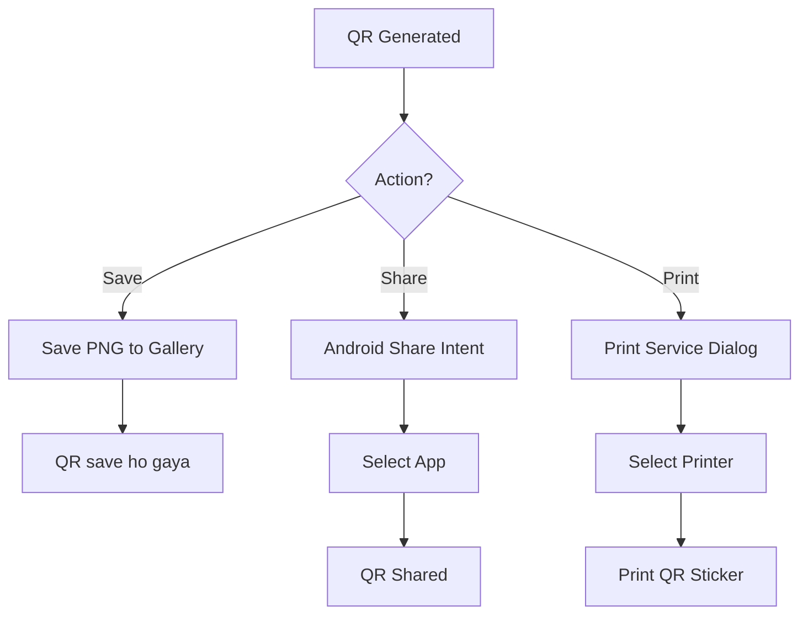

# User Flow 16: QR Print & Distribution (V2)

## Description
Vendor saves, shares, or prints their QR code for display at their shop.

## Actor(s)
- **Vendor**

## Preconditions
- QR code generated (Flow 15 completed)

## Trigger
Vendor taps Save, Share, or Print on QR screen.

## Steps

### Save to Gallery
1. Tap "Save" → QR saved as high-res PNG to device gallery
2. Toast: "QR gallery mein save ho gaya"

### Share via WhatsApp/Other
1. Tap "Share" → Android share intent opens
2. Vendor selects app (WhatsApp, Bluetooth, etc.)
3. QR image shared with message: "Mera payment QR code. Scan karke pay karein!"

### Print
1. Tap "Print" → Android print service dialog
2. Select printer (Bluetooth/WiFi/cloud printer)
3. Print at high resolution (300 DPI+) suitable for sticker

## Events Produced
- None (distribution is vendor's action)

## Postconditions
- QR available outside the app — gallery, WhatsApp, physical print

## Mermaid Flowchart

## Acceptance Criteria
- [ ] Save creates high-res PNG in gallery
- [ ] Share uses Android standard share intent
- [ ] Print outputs at minimum 300 DPI equivalent
- [ ] QR remains scannable in all output formats
- [ ] Works without internet (save and print are local)
- [ ] Share includes helpful message text

## Edge Cases
| Case | Behavior |
|---|---|
| No gallery app | Save to Downloads folder |
| No printer available | Show "Koi printer nahi mila" — suggest sharing instead |
| Low storage space | Warn before saving |
| Screenshot instead of save | Also valid — QR is visible on screen |
