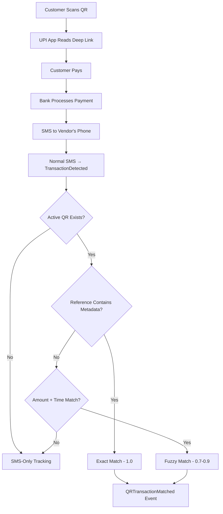

# User Flow 17: QR Payment Tracking (V2)

## Description
When a customer pays via vendor's QR code, the system matches the resulting SMS with QR metadata for enhanced accuracy.

## Actor(s)
- **Customer** (pays), **Vendor's Phone** (receives SMS), **QR Matching Engine**

## Preconditions
- Vendor has generated QR code (active in system), customer at vendor's shop

## Trigger
Customer scans vendor's QR and completes payment → SMS arrives on vendor's phone.

## Steps

1. Customer scans QR with UPI app (GPay/PhonePe/Paytm)
2. UPI app reads deep link including metadata tag in `tr` parameter
3. Customer enters amount → confirms payment
4. Payment processed by banking system (vendor's bank account credited)
5. Vendor receives payment SMS
6. Normal SMS flow: `SMSReceived` → `TransactionDetected` events
7. QR Match Automation triggers:
   - Check reference_id in SMS against active QR metadata tags
   - **Exact match** (reference_id contains metadata tag): confidence 1.0
   - **Fuzzy match** (amount + time window): confidence 0.7-0.9
   - **No match**: falls back to SMS-only (V1 behavior)
8. If matched: produce `QRTransactionMatched` event
9. Transaction tagged with QR reference → enhanced customer identification

## Events Produced
- `SMSReceived` → `TransactionDetected` (normal flow)
- `QRTransactionMatched { txnId, qrId, confidence, matchType }`

## Postconditions
- Transaction recorded with QR correlation
- Enhanced accuracy for customer identification
- Both SMS-only and QR-matched transactions coexist

## Alternative/Exception Flows

### A: Customer Pays to Vendor's Non-App QR
- Normal SMS flow works (V1 behavior)
- No QR match, no QRTransactionMatched event
- Transaction still tracked via SMS

### B: Metadata Tag Not in SMS Reference
- Fuzzy match attempted (amount + 5-min window after QR scan)
- Lower confidence score (0.7-0.9)

### C: Multiple Payments of Same Amount
- If exact metadata match → confident
- If fuzzy only → assign to most likely QR based on timestamp proximity

## Mermaid Flowchart

## Acceptance Criteria
- [ ] QR-triggered payments tracked normally via SMS (V1 fallback)
- [ ] Exact match when reference_id contains metadata tag
- [ ] Fuzzy match on amount + time window as fallback
- [ ] QRTransactionMatched event with confidence score
- [ ] Non-QR payments unaffected (V1 behavior preserved)
- [ ] Works with GPay, PhonePe, Paytm QR scanning

## Edge Cases
| Case | Behavior |
|---|---|
| UPI app strips metadata from tr parameter | Fuzzy match only |
| Customer pays twice same amount within 5 min | One matched to QR, other SMS-only |
| QR expired / inactive | No match attempted, SMS-only |
| Customer scans but doesn't pay | No SMS, no event |
