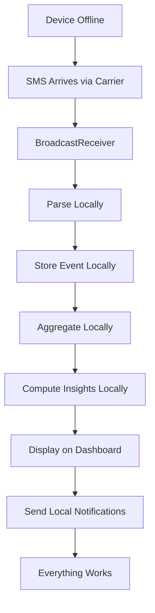

# User Flow 18: Offline Mode

## Description
All core functionality works without internet. SMS is carrier-delivered (not internet-dependent), so passive income tracking is fully offline.

## Actor(s)
- **Vendor**, **Android OS**, **App (local processing)**

## Preconditions
- App installed, SMS permission granted, no internet connection

## Trigger
Any app operation while device is offline.

## Steps

1. SMS arrives via carrier network (no internet needed)
2. BroadcastReceiver catches SMS → processes normally
3. Parser extracts transaction data → events stored in local SQLite
4. Aggregation runs locally → projections updated
5. All insights computed locally (no server dependency)
6. Dashboard displays data from local projections
7. Notifications fire via WorkManager (local scheduling)
8. Everything works exactly as if online

## Events Produced
- All normal events (SMSReceived, TransactionDetected, etc.) — stored locally

## Postconditions
- Complete app experience without internet
- No data loss
- No degraded functionality for core features

## Alternative/Exception Flows

### A: App Opened for First Time Without Internet
- Onboarding works (all content is bundled in APK)
- SMS permission works (OS dialog, no internet needed)
- Full functionality from first use

### B: Device Has Never Had Internet
- App works completely — was installed via sideload or pre-loaded
- No sync features available (but not needed)

### C: Low Storage on Device
- Event store grows slowly (~1KB per transaction)
- If critically low: warn vendor, offer to archive old projection data

## Mermaid Flowchart

## Acceptance Criteria
- [ ] SMS processing works without internet
- [ ] All parsing happens on-device
- [ ] Events stored in local SQLite
- [ ] All 14 insights computed locally
- [ ] Dashboard fully functional offline
- [ ] Notifications fire offline (WorkManager)
- [ ] No error messages about connectivity
- [ ] No "internet required" blockers anywhere in core flow
- [ ] App startup works offline

## Edge Cases
| Case | Behavior |
|---|---|
| Airplane mode (no carrier either) | No SMS delivered — no transactions to track — app shows empty |
| WiFi only device (no SIM) | No SMS capability — show warning at onboarding |
| Storage full | Warn vendor, critical events still prioritized |
| App update available but no internet | Current version continues working |
