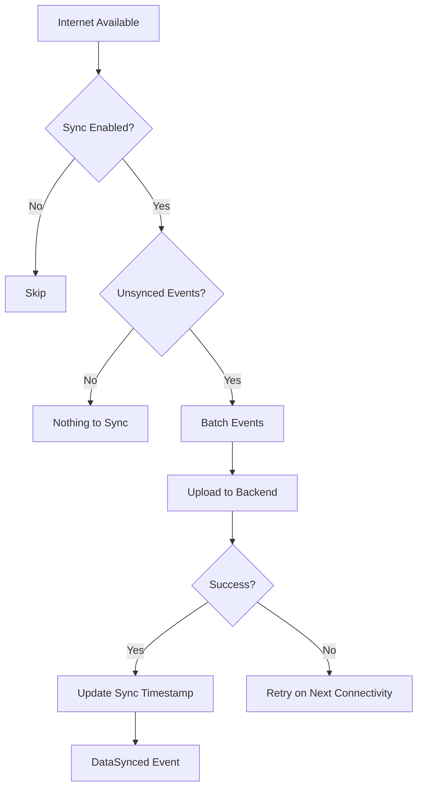

# User Flow 19: Data Sync (Optional)

## Description
When internet is available and sync is enabled, local event data syncs to the optional backend for backup.

## Actor(s)
- **Sync Service**, **Vendor** (opts in)

## Preconditions
- Internet available, vendor has opted into sync, backend configured

## Trigger
Internet connectivity restored + pending unsynced events exist.

## Steps

1. ConnectivityManager detects internet available
2. Check: is sync enabled? (user opt-in setting)
3. Check: are there unsynced events? (events after last_sync_timestamp)
4. Queue events for upload (batched, compressed)
5. Upload to backend API (delta sync — only new events since last sync)
6. Backend acknowledges with new sync timestamp
7. Produce `DataSynced` event locally
8. Download any config updates (e.g., new parser patterns) if available

## Events Produced
- `DataSynced { recordCount, lastSyncTimestamp, syncDuration }`

## Postconditions
- Local events backed up to server
- Sync timestamp updated
- No data loss if phone is lost/reset

## Alternative/Exception Flows

### A: Sync Interrupted (connection lost mid-upload)
- Resume from last acknowledged batch on next connectivity
- Events are idempotent (unique IDs) — safe to retry

### B: Vendor Never Opts Into Sync
- No sync ever happens
- All data stays local only
- Core app fully functional

### C: Conflict (somehow same event exists on server)
- Server deduplicates by event_id — idempotent
- No conflict possible in event-sourced system (events are immutable facts)

## Mermaid Flowchart

## Acceptance Criteria
- [ ] Sync is OPT-IN only (never automatic without consent)
- [ ] Delta sync — only events after last_sync_timestamp
- [ ] Idempotent — safe to retry failed syncs
- [ ] Sync failure doesn't affect app functionality
- [ ] No raw SMS bodies sent to server (only parsed events)
- [ ] DataSynced event logged locally
- [ ] Bandwidth-efficient (batched, compressed)
- [ ] Works on slow connections (2G/3G)

## Edge Cases
| Case | Behavior |
|---|---|
| 1000+ unsynced events | Batch in chunks of 100, sync progressively |
| Backend down | Retry with exponential backoff, never block app |
| Vendor disables sync after some synced data | Stop syncing, data remains on server unless deletion requested |
| Sync on metered connection | Respect Android metered connection settings |
