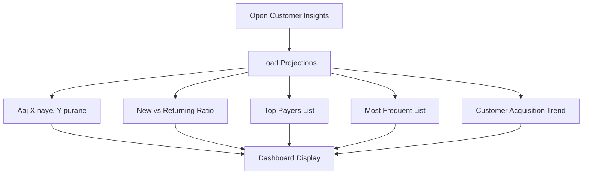

# User Flow 20: Customer Insights

## Description
Detailed customer analytics — new vs returning breakdown, customer patterns, top payers, frequency analysis.

## Actor(s)
- **Vendor**

## Preconditions
- Transaction history with customer identification data (UPI handles or names)

## Trigger
Vendor opens customer insights section.

## Steps

1. Load CustomerProfiles and today's CustomerIdentified events
2. **Today's Summary**: "Aaj 5 naye customers aaye, 12 purane"
3. **New vs Returning Ratio**: Visual split — "Naye: 29% | Purane: 71%"
4. **Top Payers (All Time)**: Ranked list with total amount
5. **Most Frequent**: Ranked list with visit count
6. **Customer Trend**: "Is hafte 15 naye customers, pichle hafte 10 the" (weekly new customer acquisition)
7. Tap any customer → see their transaction details

## Events Produced
- None (read-only projections)

## Postconditions
- Vendor understands their customer base composition and trends

## Mermaid Flowchart

## Acceptance Criteria
- [ ] Today's new vs returning count shown
- [ ] Ratio displayed simply (no pie chart — just text/bar)
- [ ] Top payers ranked by total amount
- [ ] Most frequent ranked by visit count
- [ ] Customer names displayed (from UPI handle or SMS name)
- [ ] Tap → individual customer transaction history
- [ ] Privacy: customer_id is hashed, no raw UPI shown
- [ ] Helpful empty state if no customer data yet

## Edge Cases
| Case | Behavior |
|---|---|
| All transactions anonymous | "Customer data available nahi hai" — hide section |
| Only UPI handles, no names | Show UPI handles as display names |
| Customer pays 3 times in 1 day | Counts as 1 returning visit with 3 transactions |
| 500+ unique customers | Show top 20, with "aur dekhein" expansion |
