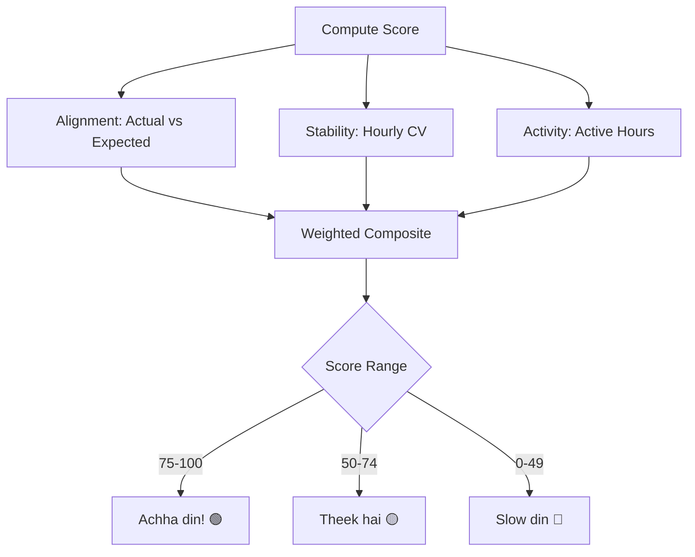

# User Flow 21: Consistency Score

## Description
Daily composite score (0-100) that tells the vendor how "consistent" their day was compared to their usual pattern.

## Actor(s)
- **Vendor**

## Preconditions
- At least 7 days of historical data

## Trigger
Dashboard load or new transaction (real-time update).

## Steps

1. Compute three sub-scores:
   - **Alignment** (40%): How close is actual to expected? `100 - |actual-expected|/expected × 100`
   - **Stability** (30%): How even is the hourly distribution? `100 - CV(hourly_amounts) × 100`
   - **Activity** (30%): How many hours had transactions? `active_hours / typical_active_hours × 100`
2. Composite: `score = 0.4 × alignment + 0.3 × stability + 0.3 × activity` (capped 0-100)
3. Display: "Aaj ka score: 85/100"
4. Simple label: >75 = "Achha din", 50-75 = "Theek hai", <50 = "Slow din"
5. Optional: show factors — "Kamai expected ke paas, achhi activity, steady flow"

## Events Produced
- `InsightGenerated { type: CONSISTENCY_SCORE, score, alignment, stability, activity }`

## Postconditions
- Vendor has a simple gauge of how their day is going

## Mermaid Flowchart

## Acceptance Criteria
- [ ] Score 0-100, composite of 3 factors (40/30/30 weights)
- [ ] Hidden when < 7 days data
- [ ] Simple label in Hinglish (Achha/Theek/Slow)
- [ ] Updates in real-time with new transactions
- [ ] No financial jargon in explanation
- [ ] Score breakdown available on tap
- [ ] Consistent with alignment-spec.md formula

## Edge Cases
| Case | Behavior |
|---|---|
| Only 1 transaction today | Low activity score, may show "Slow din" |
| Massive single transaction (5× daily avg) | High alignment if it exceeds expected |
| Sunday (typically closed) | If expected is ₹0 and actual is ₹0 → score N/A or 100 |
| First computation (7 days exactly) | Show with lower confidence |
