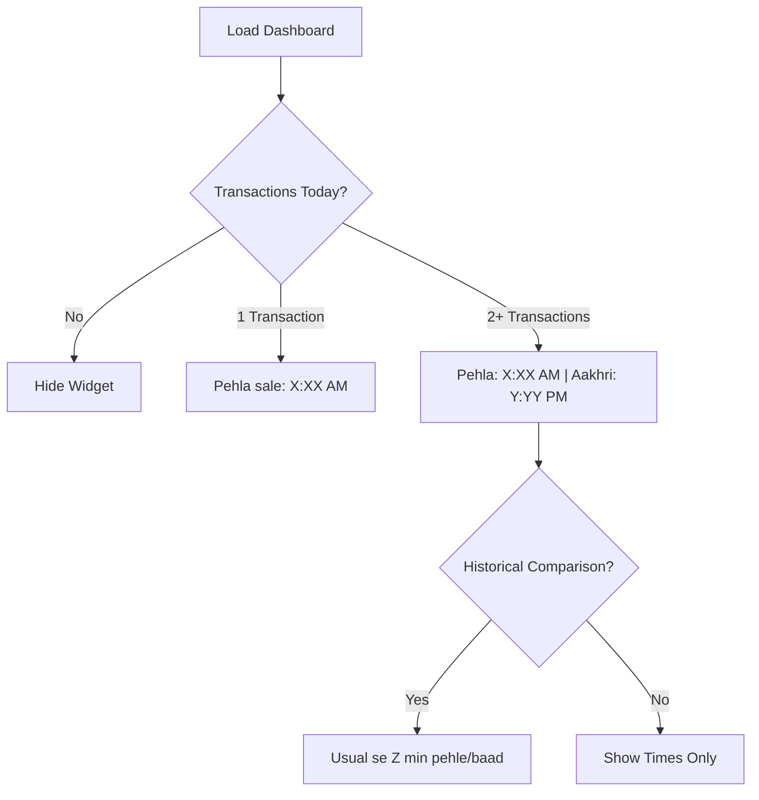

# User Flow 22: First & Last Sale Time

## Description
Shows when the first and last transaction occurred today, helping vendor understand their active window.

## Actor(s)
- **Vendor**

## Preconditions
- At least 1 transaction today

## Trigger
Dashboard load.

## Steps

1. Query min(timestamp) and max(timestamp) from today's TransactionDetected events
2. Display: "Pehla sale: 8:15 AM"
3. Display: "Aakhri sale: 9:30 PM"
4. Optional: compare with historical — "Aaj usual se 30 min pehle shuru kiya"
5. Updates last sale time with each new transaction

## Events Produced
- `InsightGenerated { type: FIRST_LAST_SALE, firstTime, lastTime }`

## Postconditions
- Vendor sees their active window for the day

## Mermaid Flowchart

## Acceptance Criteria
- [ ] Shows earliest and latest transaction timestamps
- [ ] 12-hour format: "8:15 AM", "9:30 PM"
- [ ] Hidden when no transactions today
- [ ] With 1 transaction: only "Pehla sale" shown (first = last)
- [ ] Last sale updates in real-time
- [ ] Optional historical comparison

## Edge Cases
| Case | Behavior |
|---|---|
| Single transaction at 3 PM | "Pehla sale: 3:00 PM" only |
| Transaction at midnight (12:05 AM) | "Pehla sale: 12:05 AM" — counts as today |
| Late night business (11:30 PM last) | Show accurately — "Aakhri sale: 11:30 PM" |
