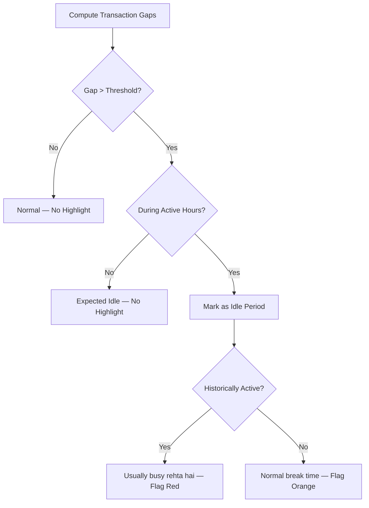

# User Flow 23: Idle Time Detection

## Description
Identifies and highlights periods with no transactions, comparing against vendor's typical activity pattern.

## Actor(s)
- **Vendor** (views hourly breakdown), **Idle Monitor**

## Preconditions
- At least 2 transactions today (need gaps to detect)

## Trigger
Hourly view loaded or idle period detected in real-time.

## Steps

1. Compute gaps between consecutive TransactionDetected events
2. Dynamic threshold: max(2 hours, avg_historical_gap × 2.5)
3. If gap > threshold during active hours → mark as idle period
4. Display in hourly view: "2-4 PM: koi payment nahi aaya"
5. Compare with historical: "Yeh time usually busy rehta hai" (if historically active)
6. Flag in red/orange on hourly breakdown

## Events Produced
- `IdleDetected { startTime, endTime, gapMinutes, threshold }` (if alertable)

## Postconditions
- Vendor sees exactly when they had dead periods

## Mermaid Flowchart

## Acceptance Criteria
- [ ] Gaps computed between consecutive successful transactions
- [ ] Default threshold: 2 hours
- [ ] Dynamic: avg_gap × 2.5 after 7 days data
- [ ] Only flags during typical active hours
- [ ] Highlighted in hourly breakdown view
- [ ] Historical comparison when available
- [ ] Visual distinction: red (unusual) vs orange (known break)

## Edge Cases
| Case | Behavior |
|---|---|
| Vendor always closed 1-3 PM (lunch) | Dynamic threshold learns this, doesn't flag |
| Only 2 transactions, 8 AM and 8 PM | 12-hour gap flagged as idle |
| Sunday — historically closed | Entire day is expected idle |
| Rapid transactions (every 2 min) then 30 min gap | Gap is below threshold, not flagged |
