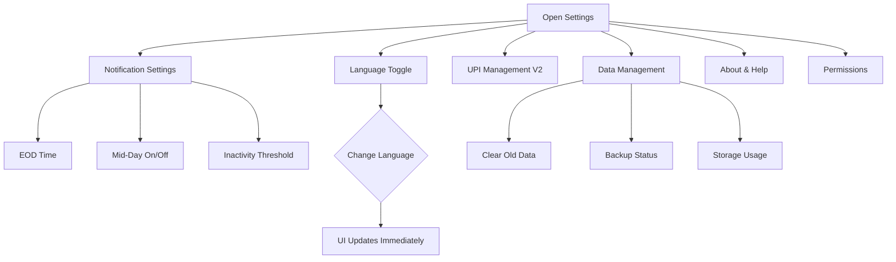

# User Flow 24: App Settings

## Description
Settings screen for notification preferences, language, UPI management, data controls, and help.

## Actor(s)
- **Vendor**

## Preconditions
- App installed and onboarded

## Trigger
Vendor taps settings icon/menu.

## Steps

1. **Notification Settings**
   - EOD summary: on/off + time (default 9 PM)
   - Mid-day alert: on/off + time (default 2 PM)
   - Inactivity alert: on/off + threshold
   - Weekly summary: on/off

2. **Language**
   - Hindi / English toggle
   - Immediate UI update on change

3. **UPI Management (V2)**
   - View active QR codes
   - Generate new QR
   - Deactivate old QR

4. **Data Management**
   - "Purana data clear karein" (clear projection data older than X days)
   - "Data backup" (if sync enabled)
   - Storage usage display

5. **About & Help**
   - App version
   - "Kaise kaam karta hai" (how it works — repeat of onboarding)
   - "Humse contact karein" (support)
   - Privacy policy (simple Hinglish version)

6. **Permissions**
   - SMS permission status indicator
   - Notification permission status
   - Quick fix buttons if permissions revoked

## Events Produced
- `SettingsChanged { setting, oldValue, newValue }` (for audit)

## Postconditions
- Settings updated and persisted (Jetpack DataStore)
- Changes take effect immediately

## Mermaid Flowchart

## Acceptance Criteria
- [ ] All notification types independently toggleable
- [ ] Notification times configurable
- [ ] Language switch takes effect immediately
- [ ] Data clear asks for confirmation ("Kya aap sure hain?")
- [ ] Permission status visible with fix buttons
- [ ] Settings persist across app restarts (DataStore)
- [ ] Simple layout, large text, minimal options
- [ ] No advanced/technical settings exposed

## Edge Cases
| Case | Behavior |
|---|---|
| Change language mid-use | All text updates immediately, no restart needed |
| Clear all data | Requires double confirmation, events preserved (read models rebuilt) |
| Disable all notifications | Allowed — app still works, just no proactive alerts |
| Revoked SMS permission (shown in settings) | Red indicator + "Fix" button → guides to OS settings |
